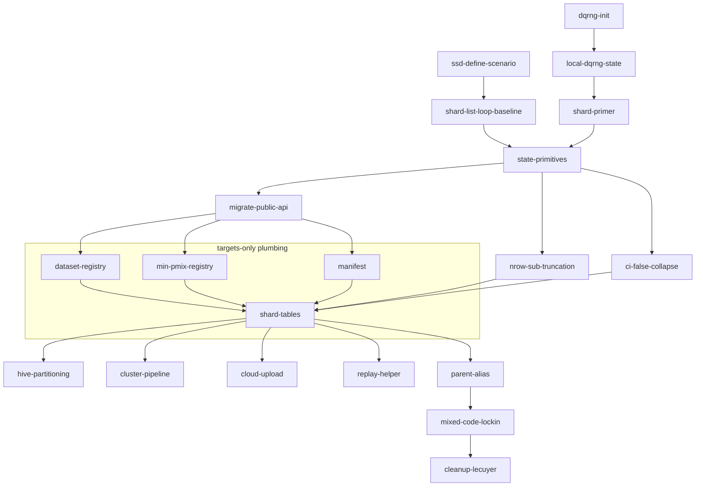

# Targets design — `ssdsims`

End-to-end workflow for running an `ssdsims` scenario on a cluster.
Three primary goals, each a hard constraint:

- **Reproducibility.** A scenario's results are bit-stable across
  reruns and machines (RNG state is explicit and serializable; §1, §2).
- **Debuggability.** Any single failed branch on the cluster must be
  replayable locally — with no `targets`, no orchestrator — using
  the same inputs the cluster used. This is what the `_state`
  primitives (`slice_sample_state()`, `fit_dists_state()`,
  `hc_state()`, each taking a per-shard **primer**) and the per-step
  Parquet partitions and their manifest are *for* (§7).
- **Extensibility.** Content-addressed Parquet files *are* the cache:
  a larger scenario reuses Parquets whose shard IDs match, computes
  the rest, and unions everything. Two named exceptions
  (`parent_alias` for renames, dag-of-dags for mixed-code re-runs)
  are documented in §8.

Parallelism is assumed throughout. The document covers, in order:
the **scenario object** and central registries (§1), the
**per-shard dqrng+hash RNG mechanism** (§2), running locally (§3),
assembling the cluster pipeline (§4), the three step grids and
their fan-outs (§5), the concrete target graph and the **cloud
upload hook** (§6), **debugging** a cluster failure (§7), and
**extension** (§8). §9 lists known limitations, §10 maps gaps from
`RNG-FLOW.md` §5 to resolutions, §11 collects open questions, and
§12 is the implementation roadmap.

Terminology (per GLOSSARY.md): **shard** = one Parquet output =
one branch of a dynamic-branched target; **step** = one of the
three stages data / fit / hc; **target** = `tar_target()`
definition; **job** = Slurm/cluster work unit. One shard ≈ one
Slurm job under `crew_controller_slurm()`, but the terms are not
synonyms — shards exist with or without a scheduler.

Background and the list of gaps this design closes are in `RNG-FLOW.md`
§5. This is a forward-looking design; it does not document the existing
PoC (PR #59).

---

## Executive summary

The most consequential design choices, with section refs:

- **Per-shard RNG via dqrng + hash, not an L'Ecuyer sub-stream
  lattice (§2).** Each shard primes dqrng PCG64 with the scenario's
  scalar `seed` plus a 64-bit `primer` derived from
  `rlang::hash(shard_params)`. Validated end-to-end by
  `scripts/experiment-dqrng-hash.R`. The choice of pcg64 is forced
  because Xoroshiro128++/Xoshiro256++ hang on length-2 `stream`
  arguments.
- **Primer / state / seed / stream are four distinct terms
  (GLOSSARY.md).** `seed` is the scenario scalar; `primer` is the
  per-shard initialiser; `state` is the RNG's internal state (the
  function-name suffix `_state` reflects the wrapper that installs
  the primer); `stream` is dqrng's API parameter and the
  L'Ecuyer-CMRG abstraction.
- **Each shard initialises the RNG once (§12 `state-primitives`).**
  The per-shard body calls `local_dqrng_state(seed, primer)`
  exactly once and then runs the (state-less) ssdtools / dplyr ops
  against the ambient RNG. No `state =` argument on the inner ops.
- **Scenario is purely declarative (§1).** Stores `seed`, knobs,
  and *names* of datasets and `min_pmix` entries; the values are
  resolved by a per-project **implicit registry** (§1.1) — a
  targets-only construct that materialises named inputs into
  `results/datasets/<name>.parquet`. Names enter the per-shard hash,
  function values do not (so a code edit / JIT does not move shards
  across primers).
- **Three step grids, one primer per shard (§5).** Data, fit and hc
  fan out independently; `nrow` is **never** an axis of the data
  step — every `nrow` value is a `head(., n)` of a single
  `n_max`-row sample, proven for both `replace` values by
  `scripts/experiment-subset-property.R`.
- **`ci = FALSE` collapses bootstrap knobs (§1.2).** When `ci =
  FALSE` the `nboot` / `ci_method` / `parametric` axes are stored
  as `NA` in the shard table — no phantom branches.
- **Per-step Parquet partitions, Hive-style (§6).** Each shard
  writes one Parquet under `results/<step>/dataset=.../sim=.../`;
  `targets` passes upstream paths into downstream branches via
  `format = "file"`, and duckplyr predicate-pushes filters into
  the partition columns. The leaf file name is the 64-bit primer
  hex.
- **Cloud upload as a scenario property (§6.1).** `scenario$upload`
  pushes each Parquet to Azure Blob (or another object store)
  right after the local write; `ssd_test_upload()` probes the
  backend at pipeline init.
- **Debug = shard row + one upstream Parquet (§7).** Any failed
  branch replays locally with `local_dqrng_state(seed, primer)` +
  the immediate-upstream Parquet, no `targets` needed; the
  lightweight recipe verifies the upstream against
  `manifest$completed_hashes` (sha256) before running the failing
  step.
- **Extension is mostly implicit (§8).** Per-step Parquet partitions
  *are* the cache: a larger scenario reuses Parquets whose primers
  match and computes the rest. Two explicit cases: `parent_alias`
  for renames (§8.1), dag-of-dags for *pinning outputs despite a
  code change* (§8.2 — the opposite of invalidation, achieved by
  declaring parent's Parquets as input files in a child project).
- **Roadmap with parallel work streams (§12).** Eighteen
  kebab-slugged steps with a Mermaid DAG showing where branches
  open. Two ground-up entries — `ssd-define-scenario` and the
  `shard-list-loop-baseline` runner — land before any RNG / dqrng
  machinery so the data shape is settled first.

---

## 1. Scenario object

The scenario is **purely declarative**. It does not carry the
materialized shard grid; expansion happens at run time via
`ssd_scenario_shards(scenario)` (§2). An S3 object holding:

```
ssdsims_scenario
├── seed         ← scalar integer; root of the per-shard RNG (§2)
├── nsim         ← number of replicate sims per dataset
├── datasets     ← character vector of dataset names referencing
│                  the central dataset registry (§1.1)
├── nrow         ← integer vector of sample sizes; subset property (§5)
├── fit          ← list of ssd_fit_dists() argument vectors;
│                  min_pmix uses NAME references into the
│                  min_pmix registry (§1.1)
├── hc           ← list of ssd_hc() argument vectors; the ci-FALSE
│                  collapse means bootstrap-only knobs (nboot,
│                  ci_method, parametric) are stored as NA on shards
│                  where ci = FALSE (§1.2)
├── upload       ← NULL (no upload) or list(backend, url, …) (§6.1)
└── parent       ← NULL, or a previous results dir referenced for
                   parent_alias / mixed-code use (§8). Plain extension
                   (more datasets, more nsim) does NOT need a parent
                   reference — the per-step Parquet partitions are the cache (file existence ⇒ cache hit).
```

Three design points distinguish this from the current code:

1. **`seed`, a scalar integer.** Re-running a scenario with a
   different RNG means changing this one number. The L'Ecuyer-CMRG
   `root_state` (length-7 vector) of the previous design is gone;
   dqrng + hash (§2) makes it unnecessary. Two scenarios with the
   same `seed` and the same shard parameters produce identical RNG
   sequences.
2. **Datasets and `min_pmix` are referenced by name.** Both live in
   central registries; the scenario stores only names. This keeps the
   scenario serializable as a tiny manifest (a few names + numeric
   knobs) and lets the per-shard hash (§2) ignore function-body
   contents — so a non-behaviour-changing code edit to a registered
   function does *not* invalidate cached results. See §1.1.
3. **No `parent` for plain extension.** Adding shards (new dataset,
   more `nsim`, more `nrow` values, …) gives them new shard hashes
   and new primers; existing shards' hashes are unchanged so their
   Parquets are reused automatically. The `parent` reference is
   only for the two cases content-addressing alone can't handle:
   renaming/reordering datasets (`parent_alias`, §8) and mixing
   old + new code after a fix (§8).

### 1.1 Implicit registries: datasets and min_pmix

The scenario object itself stores only names for datasets and
`min_pmix` entries — never the values. The actual lookup is the
**targets project's** responsibility: a `dataset-registry` target
(and a sibling `min-pmix-registry` target, §12) materialises each
referenced name into a Parquet file (for data) or pins a function
value (for `min_pmix`) once per project. The "registry" is
therefore an *implicit* part of the scenario when run through
targets; for local use (no targets) the scenario constructor
accepts data inline (`ssd_define_scenario(list(boron = ccme_boron,
…))`) and the names are derived. Two motivations for the name-only
indirection:

1. **Function-value hashes are not stable.** This is the technical
   reason and the primary one. `rlang::hash()` over a function
   serializes its representation, which is **not byte-stable** across
   apparently-equivalent forms:

   - Byte-compilation changes the hash. `compiler::cmpfun(f)` has a
     different `rlang::hash()` from the source-form `f` even though
     they evaluate identically. R's own auto-JIT triggers this
     unpredictably (the compiler may apply after a few calls).
   - Loading a function from source vs. from an installed package
     can pin different `srcref` and `environment(f)` payloads —
     same code, different hash.
   - Closures that capture different parent environments hash
     differently.

   Hashing the *name* and looking the function up at call time
   bypasses all of these. (Source edits that change behaviour are
   the user's contract — pin `ssdtools` and R versions in the
   manifest, §9.)
2. **Compact, portable scenario manifests.** A scenario serializes
   to a small JSON/Parquet sidecar containing names + numeric knobs;
   data.frame contents and function bodies live in their own files.

#### Dataset registry

```
   results/datasets/<name>.parquet     # one file per registered dataset
   results/datasets/_index.json        # name -> { rows, conc_col, sha256, source }
```

Registration:

```r
ssd_register_dataset("boron",   ssddata::ccme_boron)
ssd_register_dataset("cadmium", ssddata::ccme_cadmium)
# Synthetic / function-generated datasets are materialized at
# registration time, not lazily; the scenario hashes the name only.
ssd_register_dataset(
  "rlnorm_n100",
  generator = function(seed) {
    dqrng::dqset.seed(seed); tibble::tibble(Conc = ssdtools::ssd_rlnorm(100))
  },
  seed = 1L                       # captured so registration is deterministic
)
```

Invariant: every registered dataset has a `Conc` column (the SSD
convention; verified at registration). Other columns are passed
through.

Scenarios reference datasets by name:

```r
ssd_scenario(datasets = c("boron", "cadmium"), nsim = 100, …)
```

Synthetic datasets are **materialized at registration time**, not on
demand: they live as Parquet files in the registry alongside
real-world data. Shards reading them via name go through the same
hashed-key partition path as for empirical data. Trade-off: a
function-generated dataset must fit in memory at registration; for
large ones, generate directly to disk and register the resulting
Parquet path.

#### `min_pmix` registry

```r
ssd_register_min_pmix("default", ssdtools::ssd_min_pmix)
ssd_register_min_pmix("strict",  function(n) 0.05)
```

The scenario's `fit$min_pmix` entries are names from this registry;
the per-shard primer hash uses the name, not the function. The actual
function is looked up just before the call, after `dqset.seed()`.

### 1.2 The `ci = FALSE` collapse

The hc-arg cross-join treats `nboot`, `ci_method`, and `parametric`
as irrelevant when `ci = FALSE` — those knobs only affect bootstrap.
Concrete rules:

- If `ci = FALSE` is the only value, `nboot` / `ci_method` /
  `parametric` are ignored with a one-line message at scenario
  construction (and the scenario's `print()` records the ignore so
  it's visible in tracing).
- If both `ci = c(FALSE, TRUE)`, the `ci = FALSE` row collapses to a
  single shard per upstream fit (bootstrap knobs are NA in the grid),
  while `ci = TRUE` rows fan out across `nboot × ci_method ×
  parametric` as usual.

In the hc shard grid:

| sim | nrow | rescale | ci    | nboot | ci_method        | parametric |
| --: | ---: | :------ | :---- | ----: | :--------------- | :--------- |
| 1   | 5    | FALSE   | FALSE | NA    | NA               | NA         |
| 1   | 5    | FALSE   | TRUE  | 100   | weighted_samples | TRUE       |
| 1   | 5    | FALSE   | TRUE  | 1000  | weighted_samples | TRUE       |

The hash of an `NA`-bearing row is well-defined as long as `NA` is
encoded canonically — `shard_primer()` does this via
`rlang::hash()` on the named list. The collapse therefore stops
phantom streams from being allocated to combinations that don't
exist in practice.

---

## 2. Per-shard RNG via dqrng + hash

Validated by `scripts/experiment-dqrng-hash.R`. Each shard gets its
own **primer**, a length-2 integer derived from the hash of its
shard parameters. The scenario carries a single integer `seed`;
per-shard RNG is configured by passing the primer into dqrng's
`stream` argument:

```r
dqrng::dqset.seed(seed   = scenario$seed,
                  stream = shard_primer(shard_params))  # shard's primer
```

A **primer** is the value that, together with `seed`, fully
specifies an RNG instance's starting point — see GLOSSARY.md. For
the dqrng path it is a 64-bit integer (length-2 int); for the
legacy L'Ecuyer-CMRG path it was the length-7 state vector. The
function argument `state =` of `slice_sample_state()`,
`fit_dists_state()`, `hc_state()` carries the primer; the `_state`
suffix reflects that the function *installs the primer as the
running state* before its body executes.

(The dqrng API parameter happens to be named `stream` — that name
belongs to dqrng, not to ssdsims. In our terminology the value
passed there is a primer.)

where `shard_primer(p)` is a length-2 integer vector packing
**64 bits** of `rlang::hash(p)`:

```r
shard_primer <- function(p) {
  h <- rlang::hash(p)                 # 32-char xxhash128 hex
  c(
    hex8_to_int32(substr(h, 1L,  8L)),  # hi32: 0x80000000 -> NA_integer_
    hex8_to_int32(substr(h, 9L, 16L))   # lo32: ditto
  )
}
```

**64 bits effective.** dqrng's docs document that `stream` accepts a
length-2 integer vector representing a 64-bit value
(`?dqrng::dqRNGkind`). In R each integer is signed int32 and the bit
pattern `0x80000000` (INT_MIN) is reserved as `NA_integer_`. dqrng
accepts `NA_integer_` in `stream` and treats it as INT_MIN, so we
encode the full 64 bits by mapping the one INT_MIN bit pattern to
`NA_integer_` in the shard primer. Validated in
`scripts/experiment-dqrng-hash.R` (4): 0 empirical collisions at
100 k shards; theoretical 50% collision around `sqrt(2^64) ≈ 4.3
billion` shards. Vastly safe for ssdsims' 10²–10⁴-shard scenarios.

**Which RNG.** dqrng exposes pcg64, Xoroshiro128++/Xoshiro256++,
and Threefry. Empirically (`scripts/experiment-dqrng-hash.R`)
only pcg64 and Threefry handle a length-2 `stream` argument
without hanging — Xoroshiro/Xoshiro hang. We pick **pcg64**: well
tested, fast, supports stream by construction (each stream is a
distinct LCG increment ⇒ statistically independent sequences).
`dqRNGkind("pcg64")` is set explicitly at pipeline init; the
package's `dqRNGkind` default (Xoroshiro128++) is overridden.

`dqrng::register_methods()` is called once at pipeline init so that
base R's `runif()`, `rnorm()`, `rbinom()`, `rexp()`, `rgamma()`,
`rpois()`, `sample.int()`, `sample()` (and therefore
`dplyr::slice_sample()` and `ssdtools::ssd_r*()`) all consume RNG via
dqrng's pcg64 with the configured (seed, state). The experiment
script verifies this end-to-end.

```
   ┌────────────────────────────────────────────────────────────┐
   │  shard replay primitive                                    │
   │  ─────────────────────                                     │
   │  dqRNGkind("pcg64")                                         │
   │  dqrng::register_methods()                                  │
   │  dqset.seed(seed   = scenario$seed,                         │
   │             stream = shard$state)  # dqrng's stream arg     │
   │  …                          # run the step body            │
   │  dqrng::restore_methods()   # process-global restore on exit│
   └────────────────────────────────────────────────────────────┘
```

### Why this replaces the L'Ecuyer-CMRG sub-stream lattice

- **No precomputed lattice.** Each shard's RNG is fully specified by
  the pair `(seed, state)`. Both are small integers; the shard row
  carries them as ordinary columns, not length-7 state vectors.
- **Extension is implicit.** Adding shards (new datasets, more `sim`
  values, …) gives them new hashes and therefore new primers.
  Existing shards' states are unaffected — their hashes don't change.
- **Re-running a scenario with a different RNG** means changing
  `scenario$seed`. All shard primers are re-rooted automatically.
- **Debuggability.** The shard row carries `(seed, state)`; a
  failing branch replays locally as a one-liner (see §7).

### What goes into the hash

`shard_primer(p)` hashes a canonical, name-keyed representation of
the shard's parameters. For a data shard: `(dataset_name, sim,
replace)` only — `nrow` is *not* in the hash because every `nrow`
value is sub-truncation of the same `n_max`-row sample (§5). For a
fit shard: data-shard identity plus the fit-arg-grid row (`rescale`,
`computable`, `at_boundary_ok`, `min_pmix_name`, `range_shape1`,
`range_shape2`). For an hc shard: fit-shard identity plus the hc-arg-
grid row (`nboot`, `est_method`, `ci_method`, `parametric` — modulo
the `ci = FALSE` collapse documented in §1.2).

Function-valued parameters (`min_pmix`) are referenced **by name**
(§1.1) so that a recompile/JIT does not move the shard to a different
state; the hash is over the name, not the function value.

The restart property (`dqset.seed(seed, state) → same sequence`)
is exercised in `scripts/experiment-dqrng-hash.R`; the older
sub-stream restart check
`scripts/experiment-substream-restart.R` documents the L'Ecuyer
property that motivated the previous design and is kept for
reference.

---

## 3. Local run

```r
scenario <- ssd_scenario(
  ssddata::ccme_boron,
  nsim       = 100L,
  nrow       = c(5L, 10L, 50L),
  proportion = c(0.01, 0.05),
  nboot      = 1000,
  seed       = 42
)

ssd_run_scenario(scenario)                  # sequential, in-process
ssd_run_scenario(scenario, plan = "mirai")  # in-process parallel
```

`ssd_scenario()` stores the scenario inputs (seed, dataset names,
fit/hc arg grids). It is purely declarative — it does **not** expand
the shard grids. Expansion is `ssd_scenario_shards(scenario)`, called
either by `ssd_run_scenario()` (local) or by the `data_shards` /
`fit_shards` / `hc_shards` targets in the cluster pipeline (§4).

```
   ssd_scenario(...) ──▶ ssdsims_scenario   (declarative; carries seed)
                              │
                              ▼
                     ssd_scenario_shards(scenario)
                              │
                              ▼
                     three shard tables (data_shards, fit_shards, hc_shards),
                     each row carrying its (seed, state) pair (§2)
                              │
            ┌─────────────────┴─────────────────┐
            ▼                                   ▼
   ssd_run_scenario(scenario)         tar_target(...) feeds the
   sequential or in-process parallel  cluster pipeline (§4)
```

---

## 4. From local to a cluster

The scenario object is unchanged. **Three ingredients come together**
to produce the cluster pipeline; none of them is downstream of the
others — they're equal inputs that get assembled into the final
`_targets.R`:

```
   ┌──────────────────┐  ┌──────────────────┐  ┌──────────────────┐
   │ A. Example       │  │ B. Toy pipeline  │  │ C. Working       │
   │    pipeline for  │  │    for our       │  │    scenario      │
   │    another       │  │    target        │  │    object        │
   │    cluster       │  │    cluster       │  │                  │
   └────────┬─────────┘  └────────┬─────────┘  └────────┬─────────┘
            │                     │                     │
            └─────────────────────┼─────────────────────┘
                                  │ assemble
                                  ▼
              ┌───────────────────────────────────────┐
              │ ssdsims _targets.R for our cluster    │
              │                                       │
              │   scenario ─▶ {data,fit,hc}_shards    │
              │                            │          │
              │                            ▼          │
              │                pattern = map(...) on  │
              │             crew_controller_slurm()   │
              │                            │          │
              │                            ▼          │
              │              one Slurm job per shard, │
              │              one Parquet per shard    │
              └───────────────────────────────────────┘
```

The three ingredients are **equally important** and gathered in
parallel; none is downstream of the others. Roles:

- **A — example pipeline for another cluster** contributes the
  *shape* of `_targets.R`: how a `crew` controller is constructed,
  how dynamic branching is wired, where results land, where the
  merge target sits. Lifted as a skeleton, not as content.
  Source: another lab's published targets+crew repo.

- **B — toy pipeline for our target cluster** contributes the
  *backend*: a `crew.cluster::crew_controller_slurm()` (or
  equivalent for the actual scheduler) configured with the right
  queue, module loads, and scratch paths. Drafted with LLM help and
  validated by submitting one trivial job end-to-end **before any
  ssdsims logic is involved** — proves the cluster wiring works.

- **C — working scenario object** contributes the *content*:
  `seed`, dataset names, fit/hc argument vectors, optional
  `upload` (§6.1), optional `parent` (§8). Already exercised
  locally with `ssd_run_scenario()` (§3) so the only remaining
  unknown when assembling the three is the cluster wiring itself.

Only the controller and resource specs (from B) change between
clusters. Pipeline shape (from A) and shard content + RNG (from C)
are scheduler-independent.

---

## 5. Three grids, three fan-outs

The three RNG-touching operations consume **distinct cross-joined
parameter grids**, and the grids grow monotonically:

```
   data grid     ⊆     fit grid     ⊆     hc grid

   (dataset, sim, nrow, replace)          ┐  10 rows
        │                                 │  in the
        │ + (rescale, computable,         │  second
        │    at_boundary_ok, min_pmix,    │  example
        │    range_shape1, range_shape2)  │
        ▼                                 │
   fit grid                               │  10 rows
        │                                 │  (fit-arg
        │ + (nboot, est_method,           │   grid = 1)
        │    ci_method, parametric)       │
        ▼                                 │
   hc grid                                ┘  180 rows
                                             (10 · 6 · 3)
```

Confirmed by tracing `scripts/example.R`'s second scenario:

| step                  | grid size | fan-out                                       |
| --------------------- | --------: | --------------------------------------------- |
| `slice_sample_state()`|       10  | 2 sim · 5 nrow                                |
| `fit_dists_seed()`    |       10  | 2 sim · 5 nrow · 1 (fit-arg grid)             |
| `hc_seed()`           |      180  | 2 sim · 5 nrow · 6 nboot · 3 est_method       |

`proportion` is *inside* `ssd_hc()` (rows of the hc result tibble), not
a cross-join axis. `ci_method` and `parametric` were scalar in the
second example but are full cross-join axes in the general case.

### State allocation: one per shard, via hash

Each shard in each step's grid gets its own per-shard **state** — a
length-2 integer derived from the 64-bit hash of the shard's
parameters (§2), passed to dqrng via its `stream` argument. Shards
do not share states across steps or across grid axes; the only
sharing is the deliberate `nrow` sub-truncation below.

For the small `nsim = 2, nrow = c(5, 10), rescale = c(F, T),
est_method = c("arithmetic", "multi")` example:

```
   data grid:    2 sim · 1 (nrow is sub-truncation, not an axis)  =  2 states
   fit  grid:    data ·  2 rescale                                =  8 states
   hc   grid:    fit  ·  2 est_method                             = 16 states
                                                             sum = 26 states
```

(The legacy `scripts/example-expanded-grids-independent.R` allocated
28 by treating `nrow` as an independent axis — the design no longer
does that; see `scripts/experiment-subset-property.R` for the proof
that `nrow` is sub-truncation.)

### `nrow` is never an independent axis

For empirical-data slicing, **larger `nrow` values include the same
rows as smaller ones, byte-identically**. So `nrow` is **never** an
axis of the data state — it is just `head(., n)` of a single
`n_max`-row sample. Proven by `scripts/experiment-subset-property.R`
for both `replace = FALSE` and `replace = TRUE`. The data state is
keyed by `(dataset, sim, replace)` only, and the slice is

```r
slice_sample_state <- function(data, n_max, n, seed, state, replace) {
  dqrng::dqset.seed(seed, stream = state)   # dqrng API
  idx <- sample.int(nrow(data), size = n_max, replace = replace)
  data[idx[seq_len(n)], , drop = FALSE]
}
```

with `n_max = max(scenario$nrow)` pre-computed from the scenario.
Result: `slice_sample_state(data, n_max, 5, …)` is a prefix of
`slice_sample_state(data, n_max, 10, …)` — same `(seed, state)`,
same `sample.int` call, just truncated.

**Why the property holds for both `replace` values.**

- `replace = FALSE`: `sample.int(N, n_max, replace = FALSE)` runs
  Fisher-Yates internally; the first `n` indices are a permutation
  prefix and a valid size-`n` sample by construction.
- `replace = TRUE`: `sample.int(N, n_max, replace = TRUE)` is
  `n_max` independent uniform draws; the first `n` are a size-`n`
  sample drawn from the same RNG sequence.

Both cases assume the byte-stable behaviour of `base::sample.int()`
(and `dplyr::slice_sample()` which delegates to it). Pin R version
in the manifest (§9).

The trick costs one extra integer column on the data shard table
(`n_max`) and cuts `|data grid|` from `|dataset| · |sim| · |nrow|`
to `|dataset| · |sim| · |replace|`. For a scenario with `nrow =
c(5, 6, 10, 20, 50)` and `replace = FALSE` only, it cuts the data
fan-out by 5×.

### Implications for the targets pipeline

Each step needs its **own** shard table (`data_shards`,
`fit_shards`, `hc_shards`) and its own dynamic-branched target — a
single shared shard table mapped lockstep through all three steps
does **not** work when the grids differ. Layers link by **per-branch
file path**: each shard row carries the upstream shard IDs it
depends on (`data_id` on fit rows, `fit_id` on hc rows), and the
per-branch body opens the right upstream Parquet by that ID. §6
wires this up concretely.

---

## 6. Target graph (small example)

Concrete pipeline matching `scripts/example-expanded-grids.R`:
`nsim = 2L`, `nrow = c(5L, 10L)`, `rescale = c(FALSE, TRUE)`,
`est_method = c("arithmetic", "multi")`, `nboot = 10`, single
dataset (`ssddata::ccme_boron`). Each of the three steps fans out
according to **its own grid** (§5):

```
   data grid:  1 dataset · 2 sim · 2 nrow                     =  4 rows
   fit  grid:  data grid · 2 rescale                          =  8 rows
   hc   grid:  fit  grid · 1 nboot · 2 est_method             = 16 rows
```

The script verifies this fan-out byte-for-byte against
`ssd_run_scenario(seed = 42L, ...)`. Each step writes a Parquet
file per branch so the data, fit, and hc layers are independently
queryable for analysis without re-running upstream steps.

```
   scenario   (declarative; carries seed)
       │
       ├──▶ data_shards ( 4 rows, carries data_id, data_state)
       │         │
       │         ▼  pattern = map(data_shards)
       │     data_step  ──▶ results/data/<data_id>.parquet
       │
       ├──▶ fit_shards  ( 8 rows, carries fit_id, data_id, fit_state)
       │         │
       │         ▼  pattern = map(fit_shards)
       │     fit_step   ──▶ results/fit/<fit_id>.parquet
       │                 reads results/data/<data_id>.parquet by path
       │
       └──▶ hc_shards   (16 rows, carries hc_id, fit_id, hc_state)
                 │
                 ▼  pattern = map(hc_shards)
             hc_step    ──▶ results/hc/<hc_id>.parquet
                         reads results/fit/<fit_id>.parquet by path

   summary  ──▶ results/summary.parquet
                (reads all three layers via duckplyr)
```

The link between layers is by **per-branch file path (passed by `targets`)**, not by a
single shared dynamic-branch index — `targets` passes the upstream branch's Parquet path into each downstream branch automatically; each shard row carries its
upstream IDs (`fit_shards$data_id`, `hc_shards$fit_id`) and the body
opens the right upstream Parquet by that ID. This is what lets
tweaking `rescale` re-run fits + hc without re-running data (the
fit shard row's `data_id` is unchanged).

`_targets.R` sketch:

```r
list(
  tar_target(scenario,
    ssd_scenario(
      ssddata::ccme_boron,
      nsim = 2L,
      nrow = c(5L, 10L),
      rescale = c(FALSE, TRUE),
      est_method = c("arithmetic", "multi"),
      nboot = 10,
      seed = 42L)),

  # Three separate shard tables, one per step grid (§5). tar_group_by
  # makes each row of the shard table its own branch (one shard, one
  # Parquet, one Slurm job).
  tar_group_by(data_shards, ssd_scenario_data_shards(scenario), data_id),
  tar_group_by(fit_shards,  ssd_scenario_fit_shards(scenario),  fit_id),
  tar_group_by(hc_shards,   ssd_scenario_hc_shards(scenario),   hc_id),

  tar_target(
    data_step,
    ssd_run_data_step(data_shards, scenario, out_dir = "results/data"),
    pattern = map(data_shards), format = "file"
  ),

  tar_target(
    fit_step,
    ssd_run_fit_step(fit_shards, scenario,
                     data_dir = "results/data",
                     out_dir  = "results/fit"),
    pattern = map(fit_shards), format = "file"
  ),

  tar_target(
    hc_step,
    ssd_run_hc_step(hc_shards, scenario,
                    fit_dir = "results/fit",
                    out_dir = "results/hc"),
    pattern = map(hc_shards), format = "file"
  ),

  tar_target(
    summary,
    ssd_summarize(dir_data = "results/data",
                  dir_fit  = "results/fit",
                  dir_hc   = "results/hc",
                  path     = "results/summary.parquet"),
    format = "file"
  )
)
```

Each `ssd_run_*_step()` body reads its upstream Parquet by content-
addressed path (`fit_shards$data_id` tells the fit step which data
file to open), enters the appropriate `.state_*` from the shard row,
and writes a single Parquet to `out_dir/<id>.parquet`. To keep
`fit_step` from depending on the whole `data_step` target (which would
re-run every fit branch on any data branch change), we use file-path
indirection: the fit body opens `file.path(data_dir,
sprintf("%s.parquet", fit_shards$data_id[1]))`. `targets` tracks the
*directory* by hash of all file names it contains, so adding new data
branches does not invalidate existing fit branches.

**Dependencies and what re-runs on a knob change** (applied to the
4/8/16 grid above):

| Knob change                       | data_step (4)       | fit_step (8)        | hc_step (16)        | summary |
| --------------------------------- | ------------------- | ------------------- | ------------------- | ------- |
| dataset appended (§1.1)           | new shards only     | new only            | new only            | re-run  |
| `nrow` value added                | new shards only     | new only            | new only            | re-run  |
| `nsim` grows                      | new shards only     | new only            | new only            | re-run  |
| `dists`                           | cached              | re-run all 8        | re-run all 16       | re-run  |
| `rescale` value added             | cached              | new shards only     | new only            | re-run  |
| `nboot` added                     | cached              | cached              | new only            | re-run  |
| `est_method` value added          | cached              | cached              | new only            | re-run  |
| `ci_method` / `parametric` added  | cached              | cached              | new only            | re-run  |
| `seed`                            | re-run all 4        | re-run all 8        | re-run all 16      | re-run  |
| dataset *renamed* (no alias, §8)  | re-run all          | re-run all          | re-run all          | re-run  |

Three steps as three targets is what makes this matrix possible: the
existing per-shard design (data + fit + hc in one branch) cannot cache
a fit when only `nboot` changes.

**Available for analysis:**

After `tar_make()`, the three step layers are queryable independently
via duckplyr without going through `targets`:

```r
duckplyr::read_parquet_duckdb("results/data/*.parquet") |>
  dplyr::filter(nrow == 10L) |> dplyr::collect()
duckplyr::read_parquet_duckdb("results/fit/*.parquet")  |> ...
duckplyr::read_parquet_duckdb("results/hc/*.parquet")   |> ...
```

#### Hive-style layout for predicate pushdown

The per-branch files are written into a **Hive-partitioned**
directory tree keyed by the scenario's cross-join axes:

```
   results/
     data/  dataset=boron/   sim=1/  replace=FALSE/  <shard-primer>.parquet
            dataset=boron/   sim=2/  replace=FALSE/  <shard-primer>.parquet
            dataset=cadmium/ sim=1/  replace=FALSE/  <shard-primer>.parquet
     fit/   dataset=boron/   sim=1/  rescale=FALSE/  <shard-primer>.parquet
            …
     hc/    dataset=boron/   sim=1/  rescale=FALSE/  nboot=10/  est=arith/  <shard-primer>.parquet
            …
```

duckplyr / DuckDB read the partition columns straight out of the
directory names and use them for predicate pushdown; a query like
`filter(nrow == 10L, dataset == "boron")` only opens the relevant
files, regardless of how big the rest of the tree grows. The leaf
file name is the 64-bit `shard_primer` hex (§2) — useful for
debug (§7) but not required by the query path.

#### Linking between targets

Within the pipeline, `targets` already wires the dependency: the
fit branch for shard *S* declares `data_step_<data_id(S)>` as its
upstream and gets the **Parquet path passed in as a function
argument** (the `format = "file"` contract). No lookup-by-hash in
the body. The partition layout above is for *downstream queries*
and for the debug replay (§7), not for the inter-target wiring.

### 6.1 Cloud upload hook

The data/fit/hc Parquets are the user-facing artefacts and they need
to be readable **from outside the cluster** — analysis notebooks on a
laptop, dashboards, downstream R/Python scripts. The scenario carries
an optional `upload` field describing a destination object store; each
per-step target pushes its Parquet there right after the local write.

```
   scenario$upload (NULL by default; non-NULL example):
     list(
       backend   = "azure_blob",
       url       = "https://<acct>.blob.core.windows.net",
       container = "ssdsims-results"
     )
```

Per-step flow when `upload` is non-NULL:

```
   ssd_run_<step>_step(...)
        │
        ▼ writes results/<step>/<id>.parquet  (local; targets tracks this)
        │
        ▼ pushes the same file to  <url>/<container>/<step>/<id>.parquet
                                   (cluster-side helper, e.g. AzureStor)
        │
        ▼ records the upload's sha256 in the result manifest
```

The local Parquet stays on disk so `targets`' `format = "file"`
tracking is unaffected; the cloud copy is an additional artefact.

**Auth is external.** Credentials come from environment variables
(`AZURE_STORAGE_ACCOUNT`, `AZURE_STORAGE_KEY`, or a service-principal
combo). The scenario object does **not** carry secrets — it carries
only the destination URL and container name.

**Connectivity probe up front.** `ssd_test_upload(scenario)` performs
a minimal round-trip (list the container, write and delete a small
marker blob) and either returns silently or errors with the
backend's diagnostic. The pipeline calls it once at the start of
`tar_make()` so an auth or network failure aborts before any
compute starts. Easy to run interactively too:

```r
scenario <- ssd_scenario(..., upload = list(backend = "azure_blob", ...))
ssd_test_upload(scenario)   # silent on success, throws on failure
tar_make()
```

**Failure mode.** A per-file upload error becomes the target's error;
the local Parquet remains, so `tar_make()` can be re-driven and the
upload retried. The scenario's manifest records, per `id`, the local
sha256 and the cloud sha256; a mismatch flags a corrupted transfer.

---

## 7. Debugging a cluster failure

The targets/tarchetypes layer is an abstraction, and abstractions
cost debuggability. The cluster pipeline is only debuggable if any
single failed branch can be replayed **outside targets, on any
machine**, with the same inputs and the same RNG state.

The state-only primitives `slice_sample_state()`,
`fit_dists_state()`, `hc_state()` are the contract that makes this
work. Each takes its inputs as plain values — data, a `(seed,
state)` pair, scalar params — so the **shard row plus the
immediate upstream Parquet is a complete reproducer**.

### Scenario

`tar_make()` against `crew_controller_slurm()` fans out N hc
branches; three error on remote workers:

```
   targets reports:
     ✗ hc_step_3ab9c7   (slurm-worker-12)
     ✗ hc_step_5fe201   (slurm-worker-04)
     ✗ hc_step_91da33   (slurm-worker-21)
```

The user wants the three failures reproduced locally, fast, without
re-running the other N−3 shards.

### Recipe

```
   1. Identify the shard row (on the cluster, or after rsync).
      ─────────────────────────────────────────────────────────
      shard <- tar_read(hc_shards) |> dplyr::filter(hc_id == "3ab9c7")

      The row carries:
        - hc_state  (length-2 integer = c(hi31, lo31), §2)
        - all hc params (nboot, est_method, ci_method, ...)
        - fit_id     (content-hash of the upstream Parquet)

   2. Locate the upstream artefact by partition path.
      ───────────────────────────────────────────────────────
      results/fit/<fit_id>.parquet
      The immediate upstream is enough; no need to walk further.

   3. Sync to local.
      ──────────────
      rsync cluster:_targets/objects/hc_shards      ./_targets/objects/
      rsync cluster:results/fit/<fit_id>.parquet    ./results/fit/

   4. Reproduce, no targets involved.
      ───────────────────────────────
      fit <- ssd_read_step("results/fit/<fit_id>.parquet")
      options(error = recover)        # or place browser() in hc_state
      out <- ssdsims:::hc_state(
        data       = fit,
        seed       = scenario$seed,
        state      = shard$hc_state[[1]],
        nboot      = shard$nboot,
        est_method = shard$est_method,
        ci_method  = shard$ci_method,
        proportion = scenario$hc$proportion,
        ci         = scenario$hc$ci,
        parametric = shard$parametric,
        save_to    = NULL
      )
```

The call is the same code that ran on the worker; the `(seed,
state)` pair is the same; the upstream Parquet is the same bytes.
A deterministic bug reproduces on the first call.

### Helper

A single helper compresses steps 1, 2 and 4:

```r
ssd_replay_shard(shard_id, store = "_targets", results_dir = "results")
```

infers the step from the shard table the id sits in, opens the
immediate upstream Parquet, and calls the matching `_state`
primitive with the right args. The state-only primitives are the
supported branch-replay API.

### What makes this work

```
   ┌───────────────────────────────────────────────────────────────────┐
   │  shard row + upstream Parquet = complete reproducer               │
   │  ───────────────────────────────────────────────────              │
   │  seed       scenario-scalar integer; in the manifest              │
   │  primer     length-2 integer (hi32, lo32); on the shard row;      │
   │             passed to dqset.seed()'s `stream` arg                 │
   │  upstream   one Parquet per branch; keyed by shard-primer hash;   │
   │             tooling-agnostic (DuckDB, Python, R)                  │
   │  params     scalars on the shard row                              │
   │  primitive  `*_state()` takes (data, seed, state = primer, ...);  │
   │             no hidden dependency on targets or the orchestrator   │
   └───────────────────────────────────────────────────────────────────┘
```

`tarchetypes` is just the orchestrator. Removing it from the
reproducer is a feature, not a workaround.

### Lightweight reproduction: skip the rsync, verify the inputs

If the prefix of the pipeline is cheap to re-run, the recipe above
collapses: drive a local `tar_make()` up to the failing target and
skip step 3 entirely. The catch is **verifying that the locally
regenerated upstream matches what the cluster's failed branch
actually consumed** — without that, you might be debugging a
phantom.

The mechanism is per-Parquet content-hashing (sha256). Every Parquet the
cluster writes is fingerprinted with `sha256` and the value is
stored in the parent's manifest before any upload happens:

```r
manifest$completed_hashes[["<fit_id>"]]
#> "8c92…"  (sha256 of results/fit/<fit_id>.parquet at write time)
```

Local recipe:

```
   1. tar_make() locally up to fit_step, then look at the
      regenerated results/fit/<fit_id>.parquet.
   2. local_hash  <- digest::digest(file = "results/fit/<fit_id>.parquet",
                                    algo = "sha256")
      parent_hash <- parent_manifest$completed_hashes[["<fit_id>"]]
      stopifnot(identical(local_hash, parent_hash))
        ✓  the cluster's input is reproduced byte-for-byte;
           continue to step 4 of the rsync recipe.
        ✗  upstream is host-dependent (BLAS, system libs, env);
           fall back to rsync.
   3. With inputs verified, replay the failing hc_state() call
      directly (no targets involved) -- same as the rsync recipe.
```

Same primitive (`hc_state(data, state, ...)`); the only thing the
two recipes differ on is **where** the upstream Parquet came from.
Hash verification is the bridge.

### Constraints

- The bug must be deterministic in `(data, state, params)`. Non-
  determinism from BLAS, system libraries, or untracked global state
  is out of scope; capture `sessionInfo()` per-branch alongside the
  Parquet to narrow it.
- Content-addressing must be host-independent: the `<id>.parquet`
  name is the shard-row hash, not a path or mtime, so the same row
  on cluster and laptop resolves to the same file name.
- The manifest must record `completed_hashes` (per-id sha256). Without
  it, lightweight reproduction can't be verified.
- Only the immediate upstream is required. To debug `hc`, pull or
  regenerate the one `fit` Parquet; you do not have to refit
  upstream of that. To debug `fit`, the one `data` Parquet; you do
  not have to resample.

Once the bug is fixed, the natural follow-up is to lock in the
surviving N−3 results and re-run only the 3 failures despite the
code change. That is the same primitive as scenario extension —
see §8 (the re-run-after-fix shape is just `desired \ completed`
with `desired = parent.desired_grid`).

---

## 8. Extension

With per-shard hash-keyed states (§2) and per-step Parquet partitions
(§6), the **default** extension story is almost trivial:

```
   For each shard in scenario:
     id = shard_primer(shard_params)
     if results/<step>/<id>.parquet exists  → skip (cache hit)
     else                                    → run, write <id>.parquet
```

A "child" scenario is just a *bigger* scenario described by the same
declarative API. Shards whose `id` already has a Parquet on disk are
not re-run; the rest are. No `parent` reference, no manifest
plumbing, no `desired \ completed` set-difference machinery — content
addressing handles all of it.

| Extension                  | Mechanism                                                          |
| -------------------------- | ------------------------------------------------------------------ |
| Append a dataset           | bigger `datasets` vector ⇒ new shard IDs ⇒ new Parquets only       |
| Grow `nsim`                | bigger `nsim` ⇒ new IDs for the added `sim` values                 |
| More `nrow` values         | data step's `n_max` increases ⇒ data state re-hashes ⇒ re-run *data*; fit/hc may reuse via subset (open question, see §11) |
| Add a `rescale` / `nboot`  | new fit / hc IDs ⇒ new Parquets only                               |

Two cases need an explicit `parent` reference because content
addressing alone doesn't cover them:

### 8.1 Rename or reorder datasets — `parent_alias`

Renaming `boron → b` changes the shard ID's `dataset` field and
therefore the hash. Without help, every Parquet would look uncached.
The child scenario carries a name-mapping that's consulted *before*
the cache lookup:

```r
ssd_scenario(
  datasets     = c("b", "cd"),
  parent       = "../parent/results",
  parent_alias = c(b = "boron", cd = "cadmium"),
  …
)
```

For each new-name shard, look up the parent-name shard, check if its
Parquet exists in the parent's directory; if yes, re-attribute (link
or rename) under the new ID. No streams are allocated; no compute.

### 8.2 Mixed-code lock-in after a code fix — dag-of-dags

Two directions of "code changed, what about my Parquets?":

**(a) Force re-run of selected shards.** A bug in `hc_state()` is
fixed; the user wants the buggy Parquets re-run under the patched
code. Shard IDs are unchanged (the fix doesn't alter parameters), so
the partition lookup would still say "cache hit". Easiest move:

```r
unlink(failed_parquets)
tar_make()    # targets sees the missing files, re-runs only those
```

`targets::tar_invalidate(names = failed_branch_names)` is the
bookkeeping-preserving alternative — same end state.

**(b) Pin existing outputs *despite* a code change.** The user
edited an `_state` function (or `ssdtools` ticked over a version);
`targets`' own hash-graph would now flag every dependent branch as
out-of-date, forcing a re-run the user does *not* want. The
question is the **opposite** of invalidation — how to keep targets
from re-running things whose Parquets are still trusted.

There is no clean single-project knob for this. (`tar_target(...,
cue = tar_cue(file = "always"))` and friends are coarse and don't
distinguish "the file is fine" from "I haven't checked yet".) The
canonical workaround is **dag-of-dags**: open a child project that
declares the parent's `results/` directory as an *input* via
`tar_target(..., format = "file", command = "../parent/results/X")`.
File-as-input targets are pinned to the file's content hash, not to
the function that produced it; the child's own functions are free to
evolve without invalidating the parent's Parquets. The child does
its new compute, writes into its own `results/`, and the `summary`
target unions both directories.

The same dag-of-dags pattern is what makes 8.1 (`parent_alias`)
work — both shapes are "parent's Parquets are immutable inputs".

### 8.3 Manifest contents

Per-scenario manifest (a small JSON sidecar to the results
directory):

- `seed` — scenario's RNG root (§2).
- `datasets` — name vector referenced from shards (§1.1).
- `min_pmix` — name vector ditto.
- `fit`, `hc` — the argument-vector grids.
- `completed_ids` — set of `id`s whose Parquet exists and is
  trusted (recorded at write time, including the cloud copy's
  sha256 if `upload` is set; see §6.1, §7).
- `r_version`, `dqrng_version`, `ssdtools_version` — versions
  pinned for bit-stability across re-runs (§9).
- `dataset_names`, `min_pmix_names` — for `parent_alias` validation
  in 8.1.

Restart property for dqrng (same `(seed, state)` ⇒ same draw
sequence) is verified by `scripts/experiment-dqrng-hash.R`.

---

## 9. Limitations

Constraints the design lives with rather than solves.

### `dists` and `nboot` are not fit/hc grid axes

`dists` controls *which* distributions `ssdtools::ssd_fit_dists()`
fits to a given data slice; `nboot` controls how many bootstrap
iterations `ssdtools::ssd_hc()` runs. Both iterations live inside
ssdtools and are not exposed at the ssdsims level. Adding a
distribution to `dists` therefore invalidates every fit branch (the
hash changes); raising `nboot` invalidates every hc branch. Reusing
partial results — `nboot = 100` ⊂ `nboot = 1000` — would require
either (a) wrapping each per-distribution / per-bootstrap iteration
in ssdsims with its own dqrng stream and aggregating, or (b) an
ssdtools change to expose the inner loops. Sketch only; out of
scope.

### `ssdtools` RNG flow is opaque

The internal RNG consumption of `ssdtools::ssd_fit_dists()` and
`ssd_hc()` is a black box. We install a known `(seed, state)`
before each call, but how many uniforms the ssdtools call draws and
in what order is an ssdtools implementation detail. A breaking
change to that order in a future ssdtools release would silently
change bit-stable results even when the scenario `seed` is unchanged.
Mitigation: pin `ssdtools` (and `dqrng`, R) versions in the
scenario manifest.

### `nrow` sub-truncation requires stable `sample.int`

§5's "`nrow` is never an axis" property — `slice_sample_state`
returns a prefix of itself for smaller `n`, for both `replace`
values — holds only as long as `base::sample.int()` is byte-stable
across R versions. Validated for the current R by
`scripts/experiment-subset-property.R`; pin the R version (and
`dqrng`, `ssdtools`) in the manifest (§8.3) to guard against future
behaviour changes.

### `dqrng::register_methods()` is process-global

The pipeline installs dqrng as the base R RNG backend at start-up
and must restore on exit. Tests and helper scripts that run inside
the same R session need the same discipline (`on.exit(restore_methods())`
in any function that touches the methods).

---

## 10. Gaps from `RNG-FLOW.md` §5 — how this design closes them

| Gap                                                  | Resolution                                                                                  |
| ---------------------------------------------------- | ------------------------------------------------------------------------------------------- |
| No DAG-of-DAGs primitive                             | §8.2 — child reads parent's `results/` directly; partitions identify branches; mostly unnecessary, see below. |
| No "load previous run from Parquet" path             | §8 — per-step Parquet partitions are the cache; no explicit load needed.              |
| Persists fragile RNG state                           | §1, §2 — scenario stores a single integer `seed`; per-shard `(seed, state)` is reproducible via `dqset.seed()`. |
| Positional shard IDs                                 | §2 — shard IDs are keyed by `shard_primer(p)` = 64-bit hash of canonical params. |
| Re-derivation cost is quadratic                      | §2 — per-shard hash is O(1); no precomputed lattice.                                         |
| `nsim`-grow cache invalidation                       | §1, §2, §8 — new sim values hash to new primers; existing shard IDs (and their Parquets) are untouched. |
| Three steps cached as one (no per-step re-runs)      | §5, §6 — data/fit/hc are three grids and three targets, each with its own Parquet layer.    |
| Same lattice for all steps despite grid mismatch     | §5 — each step has its own grid and per-shard primer.                                              |
| `nrow` invalidates data states for the same `sim`    | §5 — `nrow` is never an axis: data state keyed by `(dataset, sim, replace)`, slice truncates to `n`.    |
| Single-dataset scenarios only                        | §1.1 — datasets are name-referenced in a central registry; cross-join axis.                 |
| Function-arg edits invalidate caches                 | §1.1 — `min_pmix` referenced by name; function body edits do not move shards across streams. |
| Bootstrap-only knobs spuriously fan out under `ci=FALSE` | §1.2 — `ci=FALSE` collapses `nboot`/`ci_method`/`parametric` to NA; one shard instead of N. |
| Branch failure unreproducible off the cluster        | §7 — shard row + upstream Parquet replays the failing branch via `_state` primitives.       |
| Code fix re-runs every branch by hash invalidation   | §8.2 — `unlink()` failed Parquets (or `tar_invalidate`); content addressing leaves the rest untouched. |
| Off-cluster access to Parquet outputs                | §6.1 — `scenario$upload` pushes each Parquet to a configurable object store (e.g. Azure Blob). |
| Phantom local repros (regenerated upstream ≠ cluster's actual) | §7 — manifest's per-id sha256 lets the lightweight recipe verify the local upstream before running the failing step. |

The RNGkind side-effect bug and the independent data/fit/hc substream
issues from the original L'Ecuyer design no longer apply: dqrng with
explicit `(seed, state)` per call has no side effects on global RNG
state of other shards (`register_methods()` switches the backend once
per process and is restored on exit).

---

## 11. Open questions for review

1. **`nrow` sub-truncation as a contract.** §5's `slice_sample_state`
   relies on `base::sample.int()` being a prefix-of-itself when
   `n_max` is reduced (for both `replace` values). Validated by
   `scripts/experiment-subset-property.R`; R has historically been
   stable here but it isn't a documented guarantee. Document the
   assumption in the manifest and pin R versions, or implement our
   own `sample.int`-equivalent function with an explicit contract?
2. **Dataset identity.** Datasets are keyed by **name** in the
   registry, not by `digest::digest(df)`. Two registrations under the
   same name with different bytes silently collide. Should the
   registry refuse re-registration unless byte-identical, or carry a
   content hash on the shard ID alongside the name?
3. **Force re-run inside one `targets` project.** §8.2 lists two
   options for re-running after a code fix: `unlink()` the bad
   Parquets, or `tar_invalidate(names = ...)`. Which is the
   recommended path? `unlink` is simpler but loses the bookkeeping;
   `tar_invalidate` is bookkeeping-preserving but cluster-aware
   (some `targets` versions don't propagate across remote workers).
4. **Manifest format.** A scenario manifest stores `seed`, the
   `datasets` and `min_pmix` name lists, the `fit` and `hc`
   argument-vector grids, the `upload` spec, and pinned package
   versions (§9). JSON sidecar next to Parquet, or `tar_read()`
   against the project's `_targets/` store? The latter is idiomatic
   but couples a reader to the project's `targets` version.
5. **Toy pipeline shape.** Ship a single
   `inst/targets-templates/cluster/` that the LLM-authoring prompt
   edits, or only documentation pointing at `crew.cluster` examples?

---

## 12. Roadmap

In-place, step-by-step implementation. Each bullet is identified by
a kebab-case slug and lands as a coherent working state. ssdsims
has no downstream dependencies, so breaking-change steps are fine.
**Parallel work streams are preferred** — the dependency DAG below
shows where branches open and close.

- **`ssd-define-scenario`** — Public constructor for the scenario
  object (S3); replaces the PoC's `data2`-prefixed names. Signature
  along the lines of `ssd_define_scenario(data, ..., nsim, nrow,
  rescale, est_method, nboot, ci, ...)`, forwarding the input data
  through `ssd_data()` (a tiny normaliser that validates the `Conc`
  column and tibble shape). Stores only declarative fields (seed,
  knobs, dataset names — the data registry is *implicit*, see the
  registry steps below). No RNG, no shards, no targets yet.
- **`shard-list-loop-baseline`** — Derive three shard lists (data,
  fit, hc rows; one column per cross-join axis; no RNG, no Parquet,
  no targets) from a scenario, and a runner that is just three
  `purrr::pmap()` loops. Establishes the data shape and a working
  baseline that subsequent steps swap pieces of, one at a time.
- **`dqrng-init`** — Add `dqrng` to `Imports`; `dqRNGkind("pcg64")`
  + `register_methods()` on package load, `restore_methods()` on
  unload. Verifies: `scripts/experiment-dqrng-hash.R` still passes.
- **`local-dqrng-state`** — `local_dqrng_state(seed, state,
  .local_envir = parent.frame())` thin wrapper around `dqset.seed(seed,
  stream = state)` with a `withr`-style restore on exit. Prefer
  `local_*` over `with_*` when touching code. Replaces
  `local_lecuyer_cmrg_state()` for the dqrng path.
- **`shard-primer`** — `shard_primer(params)` per §2 (64-bit hash,
  NA-as-INT_MIN encoding). Unit tests verify reproducibility and
  collision-resistance on the validated examples from
  `scripts/experiment-dqrng-hash.R`.
- **`state-primitives`** — Refactor `slice_sample_state`,
  `fit_dists_state`, `hc_state` around the new contract: **each
  per-shard body calls `local_dqrng_state(seed, primer)` exactly
  once**, then invokes the (state-less) operation against the
  ambient RNG. The `_state` suffix marks the wrapper that installs
  the primer; the inner ssdtools / dplyr calls consume RNG from the
  now-set state. No `state =` argument on the inner ops.
- **`migrate-public-api`** — Migrate `ssd_sim_data.data.frame`,
  `ssd_fit_dists_sims`, `ssd_hc_sims` to the new contract; keep the
  `_seed` wrappers as a one-release shim. `example-expanded*.R`
  re-runs with byte-equivalence.
- **`nrow-sub-truncation`** — Implement `slice_sample_state` with
  scenario-level `n_max` (per §5). Both `replace` values supported.
  Test: `nrow = c(5, 10)` results are byte-equivalent prefixes
  (cf. `scripts/experiment-subset-property.R`).
- **`ci-false-collapse`** — Implement the §1.2 collapse in the hc
  shard table. Test: `ci = c(FALSE, TRUE)` produces the reduced
  fan-out described in the §1.2 example grid.
- **`dataset-registry`** — **Targets-only**: an implicit registry
  of named datasets, implemented as a `tar_target` that writes
  Parquet to `results/datasets/<name>.parquet` from the
  `ssd_define_scenario()` input. Synthetic datasets are realised
  here at registration time. Function-name edits don't enter shard
  hashes because the scenario already refers to datasets by name.
- **`min-pmix-registry`** — **Targets-only**: same shape as
  `dataset-registry` but for `min_pmix` functions. The scenario
  refers to them by name; the targets project pins the function
  values per-run. Regression test: a body edit to a registered
  function does not move the hash of any cached fit branch.
- **`manifest`** — Per-scenario manifest writer/reader with the
  §8.3 field set; each per-shard target writes its sha256
  alongside the Parquet on success.
- **`shard-tables`** — `ssd_scenario_data_shards` /
  `_fit_shards` / `_hc_shards` returning the per-step shard tables
  with `(seed, primer)` on each row. The §6 sketch compiles and
  `tar_make()`s a tiny scenario.
- **`hive-partitioning`** — Write each per-shard Parquet under a
  Hive-partitioned path (§6 layout). Smoke: duckplyr predicate
  pushdown returns the right subset without opening unrelated
  files.
- **`cluster-pipeline`** — `inst/targets-templates/cluster/` with
  `crew.cluster::crew_controller_slurm()`. End-to-end `tar_make()`
  on a real (or sandboxed) Slurm queue.
- **`cloud-upload`** — §6.1 hook + `ssd_test_upload()`. Hello-Azure
  round trip from interactive R; `tar_make()`'s first target is the
  connectivity probe.
- **`replay-helper`** — `ssd_replay_shard()` (§7) and
  `ssd_input_hash()` for the lightweight recipe. Tests simulate a
  branch failure and reproduce locally.
- **`parent-alias`** — §8.1 — rename/reorder datasets without
  re-running. Test: renaming yields zero recomputed shards.
- **`mixed-code-lockin`** — §8.2 — `unlink()` + `tar_invalidate()`
  for forced re-runs; dag-of-dags child project for pinning
  parent outputs against code change. Both recipes have tests.
- **`cleanup-lecuyer`** — Remove the L'Ecuyer-CMRG helpers and the
  `_seed` shims; `scripts/experiment-substream-restart.R` becomes
  a historical reference.

### Dependency DAG (parallel streams)

Mermaid (renders inline on GitHub):



Three "wait points" (`state-primitives`, `shard-tables`,
`mixed-code-lockin`) gate the layers in between; anything not
chained by an arrow can be worked on in parallel.
