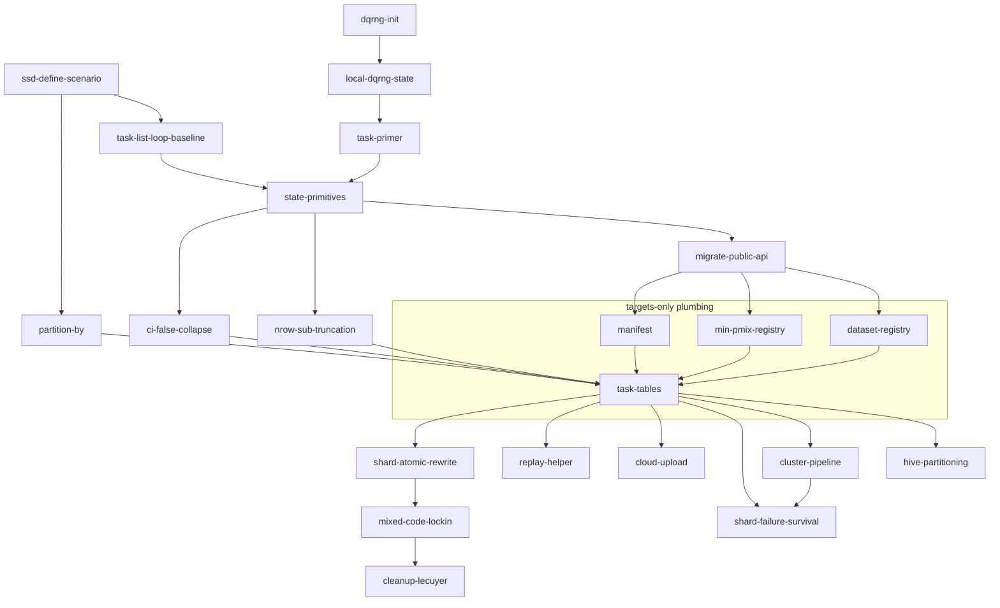

# Targets design — `ssdsims`

End-to-end workflow for running an `ssdsims` scenario on a cluster.
Three primary goals, each a hard constraint:

- **Reproducibility.** A scenario's results are bit-stable across
  reruns and machines (RNG state is explicit and serializable; §1, §2).
- **Debuggability.** Any single failed task on the cluster must be
  replayable locally — with no `targets`, no orchestrator — using
  the same inputs the cluster used. This is what the `_state`
  primitives (`slice_sample_state()`, `fit_dists_state()`,
  `hc_state()`, each taking a per-task **primer**) and the per-shard
  Parquet partitions and their manifest are *for* (§7).
- **Extensibility.** Shards are the cache unit: a larger scenario
  reuses shards with Parquets already computed and
  computes the rest. Path-axis growth adds
  new shards; inner-axis growth rewrites affected shards atomically
  (§8). Pinning outputs *despite a code change* stays inside the one
  project via `tar_cue(depend = FALSE)` — no second project needed
  (§8.3).

Parallelism is assumed throughout. The document covers, in order:
the **scenario object** and central registries (§1), the
**per-task dqrng+hash RNG mechanism** (§2), running locally (§3),
assembling the cluster pipeline (§4), the three step grids and
their fan-outs (§5), the concrete target graph and the **cloud
upload hook** (§6), **debugging** a cluster failure (§7), and
**extension** (§8). §9 lists known limitations, §10 maps gaps from
`RNG-FLOW.md` §5 to resolutions, §11 collects open questions, and
§12 is the implementation roadmap.

Terminology (per GLOSSARY.md): a **task** is one row of a
`{data,fit,hc}_tasks` table — the smallest unit of computation,
carrying a primer; a **shard** is the Parquet file produced by
running one or several tasks (depending on **partitioning**). **Step** = one of the three stages data / fit /
hc; **target** = `tar_target()` declaration; **job** = Slurm work
unit. 1 task is part of a branch of the `*_step` target; 1 branch
writes 1 shard. Independent branches/shards run in parallel; how
branches map to Slurm jobs under `crew_controller_slurm()` is an
open question (§11).

Background and the list of gaps this design closes are in `RNG-FLOW.md`
§5. This is a forward-looking design; it does not document the existing
PoC (PR #59).

---

## Executive summary

The most consequential design choices, with section refs:

- **Per-task RNG via dqrng + hash, not an L'Ecuyer sub-stream
  lattice (§2).** Each task primes dqrng PCG64 with the scenario's
  scalar `seed` plus a 64-bit `primer` derived from
  `rlang::hash(task_params)`. Validated end-to-end by
  `scripts/experiment-dqrng-hash.R`. The choice of pcg64 is forced
  because Xoroshiro128++/Xoshiro256++ hang on length-2 `stream`
  arguments. (Threefry not yet reviewed.)
- **Primer / state / seed / stream are four distinct terms
  (GLOSSARY.md).** `seed` is the scenario scalar; `primer` is the
  per-task initializer; `state` is the RNG's internal state (the
  function-name suffix `_state` reflects the wrapper that installs
  the primer); `stream` is dqrng's API parameter and the
  L'Ecuyer-CMRG abstraction.
- **Each task initializes the RNG once (§12 `state-primitives`).**
  The per-task body calls `local_dqrng_state(seed, primer)`
  exactly once and then runs the (state-less) ssdtools / dplyr ops
  against the ambient RNG. No `state =` argument on the inner ops.
- **Scenario is purely declarative (§1).** Stores `seed`, knobs,
  and *names* of datasets and `min_pmix` entries; the values are
  resolved from an **implicit registry** in the scenario (§1.1). Names enter the per-task hash,
  function definitions do not (so a code edit / JIT does not move tasks
  across primers, and the data stored in Parquet files remains simple).
- **Three step grids, one primer per task (§5).** Data, fit and hc
  fan out independently; `nrow` is **never** an axis of the data
  step — every `nrow` value is a `head(., n)` of a single
  `n_max`-row sample.
- **`ci = FALSE` collapses bootstrap knobs (§1.2).** When `ci =
  FALSE` the `nboot` / `ci_method` / `parametric` axes are stored
  as `NA` in the hc-task table — no phantom branches.
- **Per-shard Parquet shards, Hive-style (§6).** Each task writes
  one shard (one Parquet file) under
  `results/<step>/dataset=.../sim=.../`; `targets` passes upstream
  shard paths into downstream branches via `format = "file"`, and
  duckplyr predicate-pushes filters into the partition columns.
- **Cloud upload as a separate target (§6.1).** When
  `scenario$upload` is set, an `upload_<step>` target sits
  downstream of each shard file and pushes it to Azure Blob (or
  another object store). Because it is its own `format = "file"`
  target, content-hashing skips re-uploading shards that did not
  change; `ssd_test_upload()` probes the backend at pipeline init,
  and the graph still builds and dry-runs with no credentials.
- **One bad shard does not abort the run (§6.2).** Step targets
  carry `error = "null"`: a branch that errors goes `NULL`,
  `targets` records the error, and the pipeline keeps building so
  `summary` unions the survivors. Errors are read from `tar_meta()`
  *after* `tar_make()` returns (a target cannot call it mid-run).
- **Debug = task row + one upstream shard (§7).** Any failed branch
  replays locally with `local_dqrng_state(seed, primer)` + the
  immediate-upstream shard, no `targets` needed; the lightweight
  recipe verifies the upstream against `manifest$completed_shards`
  (sha256) before running the failing step.
- **Extension is mostly implicit (§8).** Shards *are* the
  cache: a larger scenario reuses shards whose partition path
  already has a Parquet, and adds shards (path-axis growth, §8.1)
  or atomically rewrites them (inner-axis growth, §8.2) as needed.
  Pinning shards *despite a code change* (the opposite of
  invalidation) is `tar_cue(depend = FALSE)` on the step targets,
  all in the one project — no child project, no `parent` reference
  (§8.3).
- **Roadmap with parallel work streams (§12).** Eighteen
  kebab-slugged steps with a Mermaid DAG showing where branches
  open. Two ground-up entries — `ssd-define-scenario` and the
  `task-list-loop-baseline` runner — land before any RNG / dqrng
  machinery so the data shape is settled first.

---

## 1. Scenario object

The scenario is **purely declarative**. It does not carry the
materialized task grid; expansion happens at run time via
`ssd_scenario_tasks(scenario)` (§2). An S3 object holding:

```
ssdsims_scenario
├── seed         ← scalar integer; root of the per-task RNG (§2)
├── nsim         ← number of replicate sims per dataset
├── datasets     ← character vector of dataset names referencing
│                  the central dataset registry (§1.1)
├── nrow         ← integer vector of sample sizes; subset property (§5)
├── fit          ← list of ssd_fit_dists() argument vectors;
│                  min_pmix uses NAME references into the
│                  min_pmix registry (§1.1)
├── hc           ← list of ssd_hc() argument vectors; the ci-FALSE
│                  collapse means bootstrap-only knobs (nboot,
│                  ci_method, parametric) are stored as NA on tasks
│                  where ci = FALSE (§1.2)
├── partition_by ← list(data = ..., fit = ..., hc = ...) of character
│                  vectors picking the Hive partition axes per step;
│                  one shard per (step, partition-cell). Default:
│                  data=(dataset,sim,replace), fit=(dataset,sim,rescale),
│                  hc=(dataset,sim). See §5.
└── upload       ← NULL (no upload) or list(backend, url, …) (§6.1)
```

There is no `parent` field. Extension never needs one: plain growth
(more datasets, more `nsim`) reuses shards by file existence
(`file existence ⇒ cache hit`, §8.1), inner-axis growth rewrites the
affected shards (§8.2), and pinning shards against a code change is
done in-project with `tar_cue(depend = FALSE)` (§8.3) rather than by
pointing a second project at this one's outputs.

Three design points distinguish this from the current code:

1. **`seed`, a scalar integer.** Re-running a scenario with a
   different RNG means changing this one number. The L'Ecuyer-CMRG
   `root_state` (length-7 vector) of the previous design is gone;
   dqrng + hash (§2) makes it unnecessary. Two scenarios with the
   same `seed` and the same task parameters produce identical RNG
   sequences.
2. **Datasets and `min_pmix` are referenced by name.** Both live in
   central registries; the scenario stores only names. This keeps the
   scenario serializable as a tiny manifest (a few names + numeric
   knobs) and lets the per-task hash (§2) ignore function-body
   contents — so a non-behavior-changing code edit to a registered
   function does *not* invalidate cached results. See §1.1.
3. **No `parent` reference at all.** Adding tasks on a *path* axis
   (new dataset, more `nsim`) creates new shards; existing shards
   are unaffected. Adding tasks on an *inner* axis (new `min_pmix`,
   new `nboot`) rewrites the affected shards atomically (§8.2). The
   one case that once seemed to need a second project pointing back
   at this one — pinning shards despite a code change — is handled
   in-project with `tar_cue(depend = FALSE)` (§8.3), so the scenario
   carries no `parent`.

### 1.1 Implicit registries: datasets and min_pmix

The scenario object itself stores only names for datasets and
`min_pmix` entries — never the values. The actual lookup is the
**targets project's** responsibility: a `dataset-registry` target
(and a sibling `min-pmix-registry` target, §12) materializes each
referenced name into a Parquet file (for data) or pins a function
value (for `min_pmix`) once per project. The "registry" is
therefore an *implicit* part of the scenario when run through
targets; for local use (no targets) the scenario constructor
accepts data inline (`ssd_define_scenario(list(boron = ccme_boron,
…))`) and the names are derived. Two motivations for the name-only
indirection:

1. **Function-value hashes are not stable.** This is the technical
   reason and the primary one. `rlang::hash()` over a function
   serializes its representation, which is **not byte-stable** across
   apparently-equivalent forms:

   - Byte-compilation changes the hash. `compiler::cmpfun(f)` has a
     different `rlang::hash()` from the source-form `f` even though
     they evaluate identically. R's own auto-JIT triggers this
     unpredictably (the compiler may apply after a few calls).
   - Loading a function from source vs. from an installed package
     can pin different `srcref` and `environment(f)` payloads —
     same code, different hash.
   - Closures that capture different parent environments hash
     differently.

   Hashing the *name* and looking the function up at call time
   bypasses all of these. (Source edits that change behavior are
   the user's contract — pin `ssdtools` and R versions in the
   manifest, §9.)
2. **Compact, portable scenario manifests.** A scenario serializes
   to a small JSON/Parquet sidecar containing names + numeric knobs;
   data.frame contents and function bodies live in their own files.

#### Dataset registry

```
   results/datasets/<name>.parquet     # one file per registered dataset
   results/datasets/_index.json        # name -> { rows, conc_col, sha256, source }
```

Registration:

```r
ssd_register_dataset("boron",   ssddata::ccme_boron)
ssd_register_dataset("cadmium", ssddata::ccme_cadmium)
# Synthetic / function-generated datasets are materialized at
# registration time, not lazily; the scenario hashes the name only.
ssd_register_dataset(
  "rlnorm_n100",
  generator = function(seed) {
    dqrng::dqset.seed(seed); tibble::tibble(Conc = ssdtools::ssd_rlnorm(100))
  },
  seed = 1L                       # captured so registration is deterministic
)
```

Invariant: every registered dataset has a `Conc` column (the SSD
convention; verified at registration). Other columns are passed
through.

Scenarios reference datasets by name:

```r
ssd_scenario(datasets = c("boron", "cadmium"), nsim = 100, …)
```

Synthetic datasets are **materialized at registration time**, not on
demand: they live as Parquet files in the registry alongside
real-world data. Tasks reading them via name go through the same
hashed-key partition path as for empirical data. Trade-off: a
function-generated dataset must fit in memory at registration; for
large ones, generate directly to disk and register the resulting
Parquet path.

#### `min_pmix` registry

```r
ssd_register_min_pmix("default", ssdtools::ssd_min_pmix)
ssd_register_min_pmix("strict",  function(n) 0.05)
```

The scenario's `fit$min_pmix` entries are names from this registry;
the per-task primer hash uses the name, not the function. The actual
function is looked up just before the call, after `dqset.seed()`.

### 1.2 The `ci = FALSE` collapse

The hc-arg cross-join treats `nboot`, `ci_method`, and `parametric`
as irrelevant when `ci = FALSE` — those knobs only affect bootstrap.
Concrete rules:

- If `ci = FALSE` is the only value, `nboot` / `ci_method` /
  `parametric` are ignored with a one-line message at scenario
  construction (and the scenario's `print()` records the ignore so
  it's visible in tracing).
- If both `ci = c(FALSE, TRUE)`, the `ci = FALSE` row collapses to a
  single task per upstream fit (bootstrap knobs are NA in the grid),
  while `ci = TRUE` rows fan out across `nboot × ci_method ×
  parametric` as usual.

In the hc task table:

| sim | nrow | rescale | ci    | nboot | ci_method        | parametric |
| --: | ---: | :------ | :---- | ----: | :--------------- | :--------- |
| 1   | 5    | FALSE   | FALSE | NA    | NA               | NA         |
| 1   | 5    | FALSE   | TRUE  | 100   | weighted_samples | TRUE       |
| 1   | 5    | FALSE   | TRUE  | 1000  | weighted_samples | TRUE       |

The hash of an `NA`-bearing row is well-defined as long as `NA` is
encoded canonically — `task_primer()` does this via
`rlang::hash()` on the named list. The collapse therefore stops
phantom streams from being allocated to combinations that don't
exist in practice.

---

## 2. Per-task RNG via dqrng + hash

Validated by `scripts/experiment-dqrng-hash.R`. Each task (= row
of a `{data,fit,hc}_tasks` table) gets its own **primer**, a
length-2 integer derived from the hash of its task parameters.
The scenario carries a single integer `seed`; per-task RNG is
configured by passing the primer into dqrng's `stream` argument:

```r
dqrng::dqset.seed(seed   = scenario$seed,
                  stream = task_primer(task_params))   # task's primer
```

A **primer** is the value that, together with `seed`, fully
specifies an RNG instance's starting point — see GLOSSARY.md. For
the dqrng path it is a 64-bit integer (length-2 int); for the
legacy L'Ecuyer-CMRG path it was the length-7 state vector. The
function argument `state =` of `slice_sample_state()`,
`fit_dists_state()`, `hc_state()` carries the primer; the `_state`
suffix reflects that the function *installs the primer as the
running state* before its body executes.

(The dqrng API parameter happens to be named `stream` — that name
belongs to dqrng, not to ssdsims. In our terminology the value
passed there is a primer.)

where `task_primer(p)` is a length-2 integer vector packing
**64 bits** of `rlang::hash(p)`:

```r
task_primer <- function(p) {
  h <- rlang::hash(p)                 # 32-char xxhash128 hex
  c(
    hex8_to_int32(substr(h, 1L,  8L)),  # hi32: 0x80000000 -> NA_integer_
    hex8_to_int32(substr(h, 9L, 16L))   # lo32: ditto
  )
}
```

**64 bits effective.** dqrng's docs document that `stream` accepts a
length-2 integer vector representing a 64-bit value
(`?dqrng::dqRNGkind`). In R each integer is signed int32 and the bit
pattern `0x80000000` (INT_MIN) is reserved as `NA_integer_`. dqrng
accepts `NA_integer_` in `stream` and treats it as INT_MIN, so we
encode the full 64 bits by mapping the one INT_MIN bit pattern to
`NA_integer_` in the task primer. Validated in
`scripts/experiment-dqrng-hash.R` (4): 0 empirical collisions at
100 k tasks; theoretical 50% collision around `sqrt(2^64) ≈ 4.3
billion` tasks. Vastly safe for ssdsims' 10²–10⁴-task scenarios.

**Which RNG.** dqrng exposes pcg64, Xoroshiro128++/Xoshiro256++,
and Threefry. Empirically (`scripts/experiment-dqrng-hash.R`)
only pcg64 and Threefry handle a length-2 `stream` argument
without hanging — Xoroshiro/Xoshiro hang. We pick **pcg64**: well
tested, fast, supports stream by construction (each stream is a
distinct LCG increment ⇒ statistically independent sequences).
`dqRNGkind("pcg64")` is set explicitly at pipeline init; the
package's `dqRNGkind` default (Xoroshiro128++) is overridden.

`dqrng::register_methods()` is called once at pipeline init so that
base R's `runif()`, `rnorm()`, `rbinom()`, `rexp()`, `rgamma()`,
`rpois()`, `sample.int()`, `sample()` (and therefore
`dplyr::slice_sample()` and `ssdtools::ssd_r*()`) all consume RNG via
dqrng's pcg64 with the configured (seed, state). The experiment
script verifies this end-to-end.

```
   ┌────────────────────────────────────────────────────────────┐
   │  task replay primitive                                     │
   │  ─────────────────────                                     │
   │  dqRNGkind("pcg64")                                         │
   │  dqrng::register_methods()                                  │
   │  dqset.seed(seed   = scenario$seed,                         │
   │             stream = task$state)   # dqrng's stream arg     │
   │  …                          # run the step body            │
   │  dqrng::restore_methods()   # process-global restore on exit│
   └────────────────────────────────────────────────────────────┘
```

### Why this replaces the L'Ecuyer-CMRG sub-stream lattice

- **No precomputed lattice.** Each task's RNG is fully specified by
  the pair `(seed, state)`. Both are small integers; the task row
  carries them as ordinary columns, not length-7 state vectors.
- **Extension is implicit.** Adding tasks (new datasets, more `sim`
  values, …) gives them new hashes and therefore new primers.
  Existing tasks' states are unaffected — their hashes don't change.
- **Re-running a scenario with a different RNG** means changing
  `scenario$seed`. All task primers are re-rooted automatically.
- **Debuggability.** The task row carries `(seed, state)`; a
  failing branch replays locally as a one-liner (see §7).

### What goes into the hash

`task_primer(p)` hashes a canonical, name-keyed representation of
the task's parameters. For a data task: `(dataset_name, sim,
replace)` only — `nrow` is *not* in the hash because every `nrow`
value is sub-truncation of the same `n_max`-row sample (§5). For a
fit task: data-task identity plus the fit-arg-grid row (`rescale`,
`computable`, `at_boundary_ok`, `min_pmix_name`, `range_shape1`,
`range_shape2`). For an hc task: fit-task identity plus the hc-arg-
grid row (`nboot`, `est_method`, `ci_method`, `parametric` — modulo
the `ci = FALSE` collapse documented in §1.2).

Function-valued parameters (`min_pmix`) are referenced **by name**
(§1.1) so that a recompile/JIT does not move the task to a different
state; the hash is over the name, not the function value.

The restart property (`dqset.seed(seed, state) → same sequence`)
is exercised in `scripts/experiment-dqrng-hash.R`; the older
sub-stream restart check
`scripts/experiment-substream-restart.R` documents the L'Ecuyer
property that motivated the previous design and is kept for
reference.

---

## 3. Local run

```r
scenario <- ssd_scenario(
  ssddata::ccme_boron,
  nsim       = 100L,
  nrow       = c(5L, 10L, 50L),
  proportion = c(0.01, 0.05),
  nboot      = 1000,
  seed       = 42
)

ssd_run_scenario(scenario)                  # sequential, in-process
ssd_run_scenario(scenario, plan = "mirai")  # in-process parallel
```

`ssd_scenario()` stores the scenario inputs (seed, dataset names,
fit/hc arg grids). It is purely declarative — it does **not** expand
the task tables. Expansion is `ssd_scenario_tasks(scenario)`, called
either by `ssd_run_scenario()` (local) or by the `data_tasks` /
`fit_tasks` / `hc_tasks` targets in the cluster pipeline (§4).

```
   ssd_scenario(...) ──▶ ssdsims_scenario   (declarative; carries seed)
                              │
                              ▼
                     ssd_scenario_tasks(scenario)
                              │
                              ▼
                     three task tables (data_tasks, fit_tasks, hc_tasks),
                     each row = one task carrying its (seed, state) pair (§2)
                              │
            ┌─────────────────┴─────────────────┐
            ▼                                   ▼
   ssd_run_scenario(scenario)         tar_target(...) feeds the
   sequential or in-process parallel  cluster pipeline (§4)
```

---

## 4. From local to a cluster

The scenario object is unchanged. **Three ingredients come together**
to produce the cluster pipeline; none of them is downstream of the
others — they're equal inputs that get assembled into the final
`_targets.R`:

```
   ┌──────────────────┐  ┌──────────────────┐  ┌──────────────────┐
   │ A. Example       │  │ B. Toy pipeline  │  │ C. Working       │
   │    pipeline for  │  │    for our       │  │    scenario      │
   │    another       │  │    target        │  │    object        │
   │    cluster       │  │    cluster       │  │                  │
   └────────┬─────────┘  └────────┬─────────┘  └────────┬─────────┘
            │                     │                     │
            └─────────────────────┼─────────────────────┘
                                  │ assemble
                                  ▼
              ┌───────────────────────────────────────┐
              │ ssdsims _targets.R for our cluster    │
              │                                       │
              │   scenario ─▶ {data,fit,hc}_tasks     │
              │                            │          │
              │                            ▼          │
              │                pattern = map(...) on  │
              │             crew_controller_slurm()   │
              │                            │          │
              │                            ▼          │
              │           shards run in parallel;     │
              │           each branch writes one shard│
              └───────────────────────────────────────┘
```

The three ingredients are **equally important** and gathered in
parallel; none is downstream of the others. Roles:

- **A — example pipeline for another cluster** contributes the
  *shape* of `_targets.R`: how a `crew` controller is constructed,
  how dynamic branching is wired, where results land, where the
  merge target sits. Lifted as a skeleton, not as content.
  Source: another lab's published targets+crew repo.

- **B — toy pipeline for our target cluster** contributes the
  *backend*: a `crew.cluster::crew_controller_slurm()` (or
  equivalent for the actual scheduler) configured with the right
  queue, module loads, and scratch paths. Drafted with LLM help and
  validated by submitting one trivial job end-to-end **before any
  ssdsims logic is involved** — proves the cluster wiring works.

- **C — working scenario object** contributes the *content*:
  `seed`, dataset names, fit/hc argument vectors, optional
  `upload` (§6.1). Already exercised
  locally with `ssd_run_scenario()` (§3) so the only remaining
  unknown when assembling the three is the cluster wiring itself.

Only the controller and resource specs (from B) change between
clusters. Pipeline shape (from A) and task content + RNG (from C)
are scheduler-independent.

---

## 5. Three grids, three fan-outs

The three RNG-touching operations consume **distinct cross-joined
parameter grids**, and the grids grow monotonically:

```
   data grid     ⊆     fit grid     ⊆     hc grid

   (dataset, sim, nrow, replace)          ┐  10 rows
        │                                 │  in the
        │ + (rescale, computable,         │  second
        │    at_boundary_ok, min_pmix,    │  example
        │    range_shape1, range_shape2)  │
        ▼                                 │
   fit grid                               │  10 rows
        │                                 │  (fit-arg
        │ + (nboot, est_method,           │   grid = 1)
        │    ci_method, parametric)       │
        ▼                                 │
   hc grid                                ┘  180 rows
                                             (10 · 6 · 3)
```

Confirmed by tracing `scripts/example.R`'s second scenario
(pre-`nrow`-sub-truncation counts; `slice_sample_state()` now fans
out by `2 sim · 1` since `nrow` is a sub-truncation axis, not a
cross-join axis — see "`nrow` is never an independent axis" below):

| step                  | grid size | fan-out                                       |
| --------------------- | --------: | --------------------------------------------- |
| `slice_sample_state()`|       10  | 2 sim · 5 nrow                                |
| `fit_dists_state()`   |       10  | 2 sim · 5 nrow · 1 (fit-arg grid)             |
| `hc_state()`          |      180  | 2 sim · 5 nrow · 6 nboot · 3 est_method       |

`proportion` is *inside* `ssd_hc()` (rows of the hc result tibble), not
a cross-join axis. `ci_method` and `parametric` were scalar in the
second example but are full cross-join axes in the general case.

### State allocation: one per task, via hash

Each task in each step's table gets its own per-task **state** — a
length-2 integer derived from the 64-bit hash of the task's
parameters (§2), passed to dqrng via its `stream` argument. Tasks
do not share states across steps or across grid axes; the only
sharing is the deliberate `nrow` sub-truncation below.

### Tasks bundle into shards by partition

Tasks are the unit of computation (one row, one primer, one
`_state` call). Shards are the unit of *storage, dispatch and
parallelism*: one shard ≡ one Parquet file ≡ one branch of the
step target, and **independent shards run in parallel**. (How
branches are packed into Slurm jobs under `crew_controller_slurm()`
is an open question — see §11.) **One shard typically contains
many tasks**: the scenario's `partition_by[[step]]` picks which
task-table columns become Hive directory levels, and every task
row sharing those column values goes into the same shard.

Default `partition_by`:

| step  | path axes                | inner axes (Parquet columns)                                  |
| ----- | ------------------------ | ------------------------------------------------------------- |
| data  | dataset, sim, replace    | (none — the data shard is a single sample)                     |
| fit   | dataset, sim, rescale    | computable, at_boundary_ok, min_pmix, range_shape1, range_shape2 |
| hc    | dataset, sim             | rescale, nboot, est_method, ci_method, parametric             |

`partition_by` is **scenario-configurable**; pushing more axes into
the path produces smaller, finer-grained shards; pushing fewer
axes produces coarser shards.

What this changes:

- **Shard count** is `Π |path axis|` per step, not `Π |task axis|`.
  For the §6 example (1 dataset · 2 sim · 2 nrow · 2 rescale · 2
  est_method, default `partition_by`): 2 data shards, 4 fit shards,
  2 hc shards (instead of 4 / 8 / 16 tasks-as-shards).
- **Per-task RNG is unchanged.** Each task in the shard runs with
  its own primer; the branch body loops over the shard's task rows
  and primes the RNG once per task.
- **Cache granularity is per shard, not per task.** Adding a new
  *inner-axis* value (e.g. a new `min_pmix`) changes the task-row
  set for every affected shard and forces an atomic rewrite of
  those Parquets (existing branches re-run). Adding a new
  *path-axis* value (e.g. a new dataset) creates new shards and
  leaves existing shards untouched — see §8.
- **Replay (§7) is still per task.** A task's primer, params, and
  the row's upstream partition-path columns fully reproduce the
  computation; the shard it happens to live in is incidental.

For the small `nsim = 2, nrow = c(5, 10), rescale = c(F, T),
est_method = c("arithmetic", "multi")` example, with the default
`partition_by` (§5):

```
                                                 tasks (primers)    shards (Parquets)
   data:  2 sim · 1 (nrow sub-trunc) · 1 replace     =  2            =  2  (1 task per shard)
   fit :  data ·  2 rescale                          =  4            =  4  (1 task per shard)
   hc  :  fit  ·  1 nboot · 2 est_method             =  8            =  2  (4 tasks per shard)
                                              total = 14 tasks       =  8 shards
```

(The legacy `scripts/example-expanded-grids-independent.R` allocated
28 by treating `nrow` as an independent axis — the design no longer
does that; see `scripts/experiment-subset-property.R` for the proof
that `nrow` is sub-truncation.)

### `nrow` is never an independent axis

For empirical-data slicing, **larger `nrow` values include the same
rows as smaller ones, byte-identically**. So `nrow` is **never** an
axis of the data state — it is just `head(., n)` of a single
`n_max`-row sample. Proven by `scripts/experiment-subset-property.R`
for both `replace = FALSE` and `replace = TRUE`. The data state is
keyed by `(dataset, sim, replace)` only, and the slice is

```r
slice_sample_state <- function(data, n_max, n, seed, state, replace) {
  dqrng::dqset.seed(seed, stream = state)   # dqrng API
  idx <- sample.int(nrow(data), size = n_max, replace = replace)
  data[idx[seq_len(n)], , drop = FALSE]
}
```

with `n_max = max(scenario$nrow)` pre-computed from the scenario.
Result: `slice_sample_state(data, n_max, 5, …)` is a prefix of
`slice_sample_state(data, n_max, 10, …)` — same `(seed, state)`,
same `sample.int` call, just truncated.

**Why the property holds for both `replace` values.**

- `replace = FALSE`: `sample.int(N, n_max, replace = FALSE)` runs
  Fisher-Yates internally; the first `n` indices are a permutation
  prefix and a valid size-`n` sample by construction.
- `replace = TRUE`: `sample.int(N, n_max, replace = TRUE)` is
  `n_max` independent uniform draws; the first `n` are a size-`n`
  sample drawn from the same RNG sequence.

Both cases assume the byte-stable behavior of `base::sample.int()`
(and `dplyr::slice_sample()` which delegates to it). Pin R version
in the manifest (§9).

The trick costs one extra integer column on the data task table
(`n_max`) and cuts `|data grid|` from `|dataset| · |sim| · |nrow|`
to `|dataset| · |sim| · |replace|`. For a scenario with `nrow =
c(5, 6, 10, 20, 50)` and `replace = FALSE` only, it cuts the data
fan-out by 5×.

### Implications for the targets pipeline

Each step needs its **own** task table (`data_tasks`, `fit_tasks`,
`hc_tasks`) and its own dynamic-branched target — a single shared
task table mapped lockstep through all three steps does **not**
work when the grids differ. Layers link via the upstream **shard's
partition path**: each task row carries the partition column
values of the upstream shard it needs (the `data_id` / `fit_id`
columns are sugar for the path), and the per-branch body opens
that one upstream Parquet. §6 wires this up concretely.

---

## 6. Target graph (small example)

Concrete pipeline matching `scripts/example-expanded-grids.R`:
`nsim = 2L`, `nrow = c(5L, 10L)`, `rescale = c(FALSE, TRUE)`,
`est_method = c("arithmetic", "multi")`, `nboot = 10`, single
dataset (`ssddata::ccme_boron`). Under the default `partition_by`
(§5), tasks fan out as:

```
   step  | tasks (rows)                                      | shards (Parquets)
   ------+---------------------------------------------------+------------------
   data  | 1 dataset · 2 sim · 1 (nrow sub-trunc) · 1 replace =  2 |  2 (path: dataset, sim, replace)
   fit   | data · 2 rescale                                  =  4 |  4 (path: dataset, sim, rescale)
   hc    | fit  · 1 nboot · 2 est_method                     =  8 |  2 (path: dataset, sim — 4 tasks per shard)
```

So in this example data and fit are 1 task : 1 shard, but hc
bundles 4 tasks into each of its 2 shards (the inner axes
`rescale`, `nboot`, `est_method` become columns inside the
shard's Parquet, not partition levels). Each step writes one
Parquet per shard so the data, fit, and hc layers are
independently queryable for analysis without re-running upstream
steps.

```
   scenario   (declarative; carries seed, partition_by)
       │
       ├──▶ data_tasks  ( 2 rows ; partition cols dataset,sim,replace)
       │         │
       │         ▼  tar_group_by(..., dataset, sim, replace)
       │     data_step  ──▶ results/data/dataset=boron/sim=1/replace=FALSE/part.parquet  (2 shards)
       │
       ├──▶ fit_tasks   ( 4 rows ; partition cols dataset,sim,rescale; data upstream)
       │         │
       │         ▼  tar_group_by(..., dataset, sim, rescale)
       │     fit_step   ──▶ results/fit/dataset=boron/sim=1/rescale=FALSE/part.parquet   (4 shards)
       │                 each shard reads the matching data shard by partition path
       │
       └──▶ hc_tasks    ( 8 rows ; partition cols dataset,sim; fit upstream)
                 │
                 ▼  tar_group_by(..., dataset, sim)
             hc_step    ──▶ results/hc/dataset=boron/sim=1/part.parquet                  (2 shards, 4 tasks each)
                         each shard reads the matching fit shard(s) by partition path

   summary  ──▶ results/summary.parquet
                (reads all three layers via duckplyr)
```

The link between steps is by **upstream partition path (passed by `targets`)**, not by a
single shared dynamic-branch index — `targets` passes the upstream branch's shard path into each downstream branch automatically. Each task row carries the upstream's partition column values; the body opens that one upstream Parquet. This is what lets tweaking `rescale` re-run fit + hc without re-running data (the fit task row's `data` partition columns are unchanged).

`_targets.R` sketch:

```r
list(
  tar_target(scenario,
    ssd_scenario(
      ssddata::ccme_boron,
      nsim = 2L,
      nrow = c(5L, 10L),
      rescale = c(FALSE, TRUE),
      est_method = c("arithmetic", "multi"),
      nboot = 10,
      seed = 42L)),

  # Three separate task tables, one per step grid (§5). tar_group_by
  # buckets task rows by the step's partition_by columns; each group
  # becomes one branch (= one shard out, possibly many tasks).
  # Independent branches run in parallel; how they pack into Slurm
  # jobs under crew_controller_slurm() is an open question (§11).
  tar_group_by(data_tasks, ssd_scenario_data_tasks(scenario), dataset, sim, replace),
  tar_group_by(fit_tasks,  ssd_scenario_fit_tasks(scenario),  dataset, sim, rescale),
  tar_group_by(hc_tasks,   ssd_scenario_hc_tasks(scenario),   dataset, sim),

  # error = "null" so one bad shard does not abort the run: the
  # branch goes NULL, the error is recorded, the rest keeps building
  # and summary unions the survivors (§6.2). format = "file" passes
  # the shard path, not its value, between targets (see below).
  tar_target(
    data_step,
    ssd_run_data_step(data_tasks, scenario, out_dir = "results/data"),
    pattern = map(data_tasks), format = "file", error = "null"
  ),

  tar_target(
    fit_step,
    ssd_run_fit_step(fit_tasks, scenario,
                     data_dir = "results/data",
                     out_dir  = "results/fit"),
    pattern = map(fit_tasks), format = "file", error = "null"
  ),

  tar_target(
    hc_step,
    ssd_run_hc_step(hc_tasks, scenario,
                    fit_dir = "results/fit",
                    out_dir = "results/hc"),
    pattern = map(hc_tasks), format = "file", error = "null"
  ),

  tar_target(
    summary,
    ssd_summarize(dir_data = "results/data",
                  dir_fit  = "results/fit",
                  dir_hc   = "results/hc",
                  path     = "results/summary.parquet"),
    format = "file"
  )
)
```

A step body (sketch):

```r
ssd_run_fit_step <- function(fit_tasks_group, scenario, data_dir, out_dir) {
  rows <- purrr::pmap_dfr(fit_tasks_group, function(task_id, primer, data_id,
                                                   rescale, min_pmix, ...) {
    upstream <- arrow::read_parquet(file.path(data_dir,
                                              # partition path from upstream cols
                                              .upstream_path(...),
                                              "part.parquet"))
    local_dqrng_state(scenario$seed, primer)
    tibble::tibble(task_id = task_id,
                   rescale = rescale,
                   min_pmix = min_pmix,
                   fit = list(fit_dists_state(upstream, rescale, min_pmix, ...)))
  })
  out <- file.path(out_dir,
                   .partition_path(fit_tasks_group, scenario$partition_by$fit),
                   "part.parquet")
  dir.create(dirname(out), recursive = TRUE, showWarnings = FALSE)
  arrow::write_parquet(rows, out)
  out
}
```

The body loops once per task in the group, primes the RNG with
that task's primer, calls the (state-less) `_state` primitive, and
stacks K result rows into one Parquet at the shard's partition
path. To keep `fit_step` from depending on the whole `data_step`
target (which would re-run every fit branch on any data branch
change), we use file-path indirection: the fit body opens the one
upstream data shard via its partition path. `targets` tracks the
*directory* by hash of all file names it contains, so adding new
data shards does not invalidate existing fit shards.

**Dependencies and what re-runs on a knob change** (applied to the
2/4/2 shard counts above; "1 shard re-runs" = its Parquet is
rewritten with the new task set):

| Knob change                       | data_step (2 shards)              | fit_step (4 shards)               | hc_step (2 shards)                | summary |
| --------------------------------- | --------------------------------- | --------------------------------- | --------------------------------- | ------- |
| dataset appended (path axis everywhere) | new shards only             | new shards only                   | new shards only                   | re-run  |
| `sim` value (= `nsim` grows; path axis everywhere) | new shards only  | new shards only                   | new shards only                   | re-run  |
| `nrow` value added (sub-trunc; not an axis) | rewrite all if `max(nrow)` grows; cached otherwise | inherits via prefix (open Q, §11) | inherits via prefix (open Q, §11) | re-run  |
| `replace` value added (data path; fit/hc inner under default) | new shards only | rewrite all (`replace` ∈ fit inner) | rewrite all (`replace` ∈ hc inner) | re-run  |
| `rescale` value added (fit path; hc inner under default) | cached    | new shards only                   | rewrite all (`rescale` ∈ hc inner) | re-run  |
| `dists` change (fit inner)        | cached                            | rewrite all 4                     | rewrite all 2                     | re-run  |
| `min_pmix` value (fit inner)      | cached                            | rewrite all 4                     | rewrite all 2                     | re-run  |
| `nboot` value added (hc inner)    | cached                            | cached                            | rewrite all 2                     | re-run  |
| `est_method` value added (hc inner) | cached                          | cached                            | rewrite all 2                     | re-run  |
| `ci_method` / `parametric` added (hc inner) | cached                  | cached                            | rewrite all 2                     | re-run  |
| `seed`                            | re-run all                        | re-run all                        | re-run all                        | re-run  |

Three steps as three targets is what makes this matrix possible: a
single combined branch (data + fit + hc) cannot cache a fit shard
when only `nboot` changes.

**Available for analysis:**

After `tar_make()`, the three step layers are queryable independently
via duckplyr without going through `targets` (Hive-partitioned reads
auto-discover the partition columns from the path):

```r
duckplyr::read_parquet_duckdb("results/data/**/*.parquet") |>
  dplyr::filter(dataset == "boron", sim == 1L) |> dplyr::collect()
duckplyr::read_parquet_duckdb("results/fit/**/*.parquet")  |> ...
duckplyr::read_parquet_duckdb("results/hc/**/*.parquet")   |> ...
```

Path-axis filters push down to the directory tree (no irrelevant
Parquets opened); inner-axis filters (e.g. `min_pmix == "default"`)
push down to row-group metadata but still need to open the
relevant Parquets.

#### Hive-style layout for predicate pushdown

Shards are written into a **Hive-partitioned** directory tree
keyed by the step's `partition_by` columns (defaults from §5):

```
   results/
     data/  dataset=boron/   sim=1/  replace=FALSE/  part.parquet
            dataset=boron/   sim=2/  replace=FALSE/  part.parquet
            dataset=cadmium/ sim=1/  replace=FALSE/  part.parquet
     fit/   dataset=boron/   sim=1/  rescale=FALSE/  part.parquet
            …
     hc/    dataset=boron/   sim=1/                  part.parquet
            …
```

duckplyr / DuckDB read the partition columns straight out of the
directory names and use them for predicate pushdown; a query like
`filter(dataset == "boron", sim == 1L)` only opens the relevant
shards, regardless of how big the rest of the tree grows. **Inner
axes** (those not in `partition_by`) are ordinary columns inside
the Parquet — still filterable, just not via path-level pushdown.
The leaf file name is the fixed string `part.parquet`; the Hive
path uniquely identifies the shard, so no hash in the name.

#### Linking between targets

Within the pipeline, `targets` already wires the dependency: the
fit branch for shard *S* declares the upstream data shard at the
matching partition path and gets the **shard path passed in as a
function argument** (the `format = "file"` contract). No
lookup-by-hash in the body. The partition layout above is for
*downstream queries* and for the debug replay (§7), not for the
inter-target wiring.

#### Why `format = "file"`, not the native Parquet store

`targets` ships a native Parquet store (`tar_option_set(format =
"parquet")`) that serialises each target's value to Parquet with no
explicit write — the obvious first reach. An independent experiment
ruled it out: depending on such a target **eagerly deserialises its
value back into R**, even when the downstream body only wants the
store path, so it does *not* avoid the R roundtrip; and the store
layout (`_targets/objects/<name>`, no extension) is not a stable
contract to read against from outside `targets`. `format = "file"`
is the seam that actually passes storage between targets without the
roundtrip: the target's value *is* the Parquet path, so a downstream
branch receives a string and hands it straight to duckplyr / `arrow`
/ the uploader. That is why every step target here — and the
`summary` and `upload_<step>` targets — is `format = "file"`.

### 6.1 Cloud upload hook

The data/fit/hc shards are the user-facing artefacts and they need
to be readable **from outside the cluster** — analysis notebooks on a
laptop, dashboards, downstream R/Python scripts. The scenario carries
an optional `upload` field describing a destination object store.

```
   scenario$upload (NULL by default; non-NULL example):
     list(
       backend   = "azure_blob",
       url       = "https://<acct>.blob.core.windows.net",
       container = "ssdsims-results"
     )
```

**Upload is its own target, not an inline side effect.** When
`upload` is non-NULL the pipeline adds an `upload_<step>` target
downstream of each step, mapping over the same shards:

```r
tar_target(
  upload_fit,
  ssd_upload_shard(fit_step, scenario$upload),   # fit_step = the shard path
  pattern = map(fit_step), format = "file", error = "null"
)
```

An independent experiment showed why this beats pushing the blob
from inside `ssd_run_<step>_step()` right after the local write:

- **Content-hashing skips unchanged shards.** Because `upload_<step>`
  takes the shard's path (`format = "file"`) as input, `targets`
  re-runs it only when that shard's content hash changes. A re-driven
  `tar_make()` that rebuilt nothing uploads nothing; a partial
  extension uploads only the new/rewritten shards.
- **The graph builds and dry-runs with no credentials.**
  `ssd_upload_shard()` checks for credentials and, when absent,
  returns the local path as a no-op (a dry run) instead of erroring —
  so the same pipeline is runnable offline and against real cloud
  storage, and the upload nodes still appear in the DAG.
- **Concerns stay separated by dependency.** The compute manifest
  depends only on the shard targets (what was produced); the upload
  manifest depends on the `upload_<step>` targets (what was shipped).
  A reader that needs only uploaded data depends on the latter.

Per-shard flow when `upload` is non-NULL:

```
   <step>_step branch  ──▶ results/<step>/<partition-path>/part.parquet
        │                  (local shard; targets tracks it, format = "file")
        ▼
   upload_<step> branch ──▶ <url>/<container>/<step>/<partition-path>/part.parquet
                            (own target; runs only if the shard hash changed,
                             dry-run no-op when credentials are absent)
        │
        ▼ records the upload's sha256 in the result manifest
```

The local shard stays on disk so `targets`' `format = "file"`
tracking is unaffected; the cloud copy is an additional artefact.

**Auth is external.** Credentials come from environment variables
(`AZURE_STORAGE_ACCOUNT`, `AZURE_STORAGE_KEY`, or a service-principal
combo). The scenario object does **not** carry secrets — it carries
only the destination URL and container name. Their absence is what
flips `ssd_upload_shard()` into its dry-run no-op.

**Connectivity probe up front.** `ssd_test_upload(scenario)` performs
a minimal round-trip (list the container, write and delete a small
marker blob) and either returns silently or errors with the
backend's diagnostic. The pipeline calls it once at the start of
`tar_make()` so an auth or network failure aborts before any
compute starts. Easy to run interactively too:

```r
scenario <- ssd_scenario(..., upload = list(backend = "azure_blob", ...))
ssd_test_upload(scenario)   # silent on success, throws on failure
tar_make()
```

**Failure mode.** A per-shard upload error becomes that
`upload_<step>` branch's error (and, under `error = "null"`, leaves
the rest uploading); the local shard remains, so `tar_make()` can be
re-driven and only the failed uploads retried. The scenario's
manifest records, per shard, the local sha256 and the cloud sha256; a
mismatch flags a corrupted transfer.

### 6.2 Surviving a failed shard

A single bad shard must not abort an N-shard cluster run. Every step
target (and `upload_<step>`) carries `error = "null"`: a branch that
errors has its value set to `NULL`, `targets` records the error in
its metadata, and the rest of the pipeline keeps building, so
`summary` unions the shards that did land instead of `tar_make()`
halting on the first failure. An errored branch is always out of
date, so a re-driven `tar_make()` after a fix retries only the failed
shards (§8.4).

Two constraints, both confirmed by independent experiments:

- **Errors are read *after* the run, not inside it.** A target cannot
  call `tar_meta()` (or other store functions) while the pipeline is
  running. So `summary` detects a gap from the missing shard / `NULL`
  value *inside* the DAG, and the error *messages* are pulled from
  metadata once `tar_make()` returns:

  ```r
  tar_make()
  tar_meta(fields = "error") |> dplyr::filter(!is.na(error))
  ```

- **The end-of-pipeline warning needs handling, not silencing.** Even
  with `error = "null"`, `tar_make()` emits a "some targets errored"
  warning at the end; under `options(warn = 2)` that becomes an abort.
  The runner wraps `tar_make()` in a `withCallingHandlers()` that
  muffles only that one expected warning rather than relaxing the
  global option.

**The `NULL` must flow cleanly downstream.** A failed shard's value is
`NULL`, and the targets immediately downstream — the `upload_<step>`
branch (§6.1) and the two manifests — have to tolerate it rather than
choke. `ssd_upload_shard(NULL, ...)` records the shard as a skip
instead of erroring, and the compute / upload manifests simply omit
it; the survivors still upload and `summary` still unions them. An
independent experiment that composed a dynamically-sized fan-out, this
`error = "null"` handling, and the per-shard upload target found this
`NULL`-tolerance in the upload and manifest helpers was the *only*
glue the composition needed — and that once the failing branch is
fixed under the §8.3 pin, only that one shard rebuilds, re-uploads,
and is re-queried (a minimal re-run, not a full redo).

---

## 7. Debugging a cluster failure

The targets/tarchetypes layer is an abstraction, and abstractions
cost debuggability. The cluster pipeline is only debuggable if any
single failed branch can be replayed **outside targets, on any
machine**, with the same inputs and the same RNG state.

The state-only primitives `slice_sample_state()`,
`fit_dists_state()`, `hc_state()` are the contract that makes this
work. Each takes its inputs as plain values — data, a `(seed,
state)` pair, scalar params — so the **failing task's row plus
the immediate upstream shard is a complete reproducer**, even
when the failing branch processed many other tasks alongside it.

### Scenario

`tar_make()` against `crew_controller_slurm()` fans out N hc
shards; three branches error on remote workers:

```
   targets reports:
     ✗ hc_step_3ab9c7   (slurm-worker-12)
     ✗ hc_step_5fe201   (slurm-worker-04)
     ✗ hc_step_91da33   (slurm-worker-21)
```

The user wants the failing tasks reproduced locally, fast,
without re-running every other shard.

### Recipe

```
   1. Identify the failing task row.
      ──────────────────────────────
      # Find the task that errored within the failing branch:
      # branch error message names the shard's partition path;
      # within the shard the task_id of the bad row is in the log.
      task <- tar_read(hc_tasks) |> dplyr::filter(task_id == "3ab9c7")

      The row carries:
        - primer    (length-2 integer = c(hi31, lo31), §2)
        - all hc params (nboot, est_method, ci_method, ...)
        - upstream fit-shard partition values (dataset, sim, rescale)
          — enough to reconstruct results/fit/dataset=.../sim=.../rescale=.../part.parquet

   2. Locate the upstream shard by partition path.
      ────────────────────────────────────────────
      results/fit/dataset=<...>/sim=<...>/rescale=<...>/part.parquet
      The immediate upstream is enough; no need to walk further.

   3. Sync to local.
      ──────────────
      rsync cluster:_targets/objects/hc_tasks   ./_targets/objects/
      rsync cluster:<upstream_path>             ./<upstream_path>

   4. Reproduce, no targets involved.
      ───────────────────────────────
      fit <- arrow::read_parquet(<upstream_path>) |>
             # the fit shard may contain multiple fit task rows;
             # pick the one this hc task points to.
             dplyr::filter(task_id == task$fit_id) |>
             dplyr::pull(fit) |> .subset2(1L)
      options(error = recover)        # or place browser() in hc_state
      out <- ssdsims:::hc_state(
        data       = fit,
        seed       = scenario$seed,
        state      = task$primer[[1]],
        nboot      = task$nboot,
        est_method = task$est_method,
        ci_method  = task$ci_method,
        proportion = scenario$hc$proportion,
        ci         = scenario$hc$ci,
        parametric = task$parametric,
        save_to    = NULL
      )
```

The call is the same code that ran on the worker; the `(seed,
state)` pair is the same; the upstream Parquet is the same bytes.
A deterministic bug reproduces on the first call.

### Helper

A single helper compresses steps 1, 2 and 4:

```r
ssd_replay_task(task_id, store = "_targets", results_dir = "results")
```

infers the step from the task table the id sits in, opens the
upstream shard at the right partition path, filters it down to the
one upstream task row, and calls the matching `_state` primitive
with the right args. The state-only primitives are the supported
task-replay API.

### What makes this work

```
   ┌───────────────────────────────────────────────────────────────────┐
   │  task row + upstream shard = complete reproducer                  │
   │  ─────────────────────────────────────────────                    │
   │  seed       scenario-scalar integer; in the manifest              │
   │  primer     length-2 integer (hi32, lo32); on the task row;       │
   │             passed to dqset.seed()'s `stream` arg                 │
   │  upstream   one shard per partition cell; keyed by Hive path;     │
   │             tooling-agnostic (DuckDB, Python, R)                  │
   │  params     scalars on the task row                               │
   │  primitive  `*_state()` takes (data, seed, state = primer, ...);  │
   │             no hidden dependency on targets or the orchestrator   │
   └───────────────────────────────────────────────────────────────────┘
```

`tarchetypes` is just the orchestrator. Removing it from the
reproducer is a feature, not a workaround.

### Lightweight reproduction: skip the rsync, verify the inputs

If the prefix of the pipeline is cheap to re-run, the recipe above
collapses: drive a local `tar_make()` up to the failing target and
skip step 3 entirely. The catch is **verifying that the locally
regenerated upstream matches what the cluster's failed branch
actually consumed** — without that, you might be debugging a
phantom.

The mechanism is per-shard content-hashing (sha256). Every shard
the cluster writes is fingerprinted with `sha256` and the value is
stored in the cluster run's manifest, keyed by the shard's partition
path, before any upload happens:

```r
manifest$completed_shards[["fit/dataset=boron/sim=1/rescale=FALSE"]]
#> "8c92…"  (sha256 of part.parquet at write time)
```

Local recipe:

```
   1. tar_make() locally up to fit_step, then look at the
      regenerated upstream shard at its partition path.
   2. local_hash   <- digest::digest(file = <upstream_path>, algo = "sha256")
      cluster_hash <- cluster_manifest$completed_shards[[<partition_key>]]
      stopifnot(identical(local_hash, cluster_hash))
        ✓  the cluster's input is reproduced byte-for-byte;
           continue to step 4 of the rsync recipe.
        ✗  upstream is host-dependent (BLAS, system libs, env);
           fall back to rsync.
   3. With inputs verified, replay the failing hc_state() call
      directly (no targets involved) -- same as the rsync recipe.
```

Same primitive (`hc_state(data, state, ...)`); the only thing the
two recipes differ on is **where** the upstream shard came from.
Hash verification is the bridge.

### Constraints

- The bug must be deterministic in `(data, state, params)`. Non-
  determinism from BLAS, system libraries, or untracked global state
  is out of scope; capture `sessionInfo()` per-branch alongside the
  Parquet to narrow it.
- Content-addressing must be host-independent: the shard's
  partition path is derived from task-table column values, not from
  any host-local state, so the same task on cluster and laptop
  resolves to the same shard path.
- The manifest must record `completed_shards` (partition path →
  sha256). Without it, lightweight reproduction can't be verified.
- Only the immediate upstream is required. To debug `hc`, pull or
  regenerate the one `fit` shard; you do not have to refit upstream
  of that. To debug `fit`, the one `data` shard; you do not have
  to resample.

Once the bug is fixed, the natural follow-up is to lock in the
surviving N−3 shards and re-run only the 3 failures despite the
code change — see §8.4 (`unlink()` the bad Parquets + `tar_make()`),
or §8.3 (`tar_cue(depend = FALSE)` to pin the survivors against the
edit) depending on the scope of the change.

---

## 8. Extension

Shards are the cache unit. The shard's identity is its **partition
path** (`results/<step>/dataset=.../sim=.../…/`), and its contents
are the rows of the step's task table that share those partition
column values. Extension is the answer to one question per
extension type: *does the new scenario change the set of shards,
or the contents of an existing shard?*

### 8.1 Path-axis growth — new shards, existing shards untouched

Adding a value to an axis that is **in `partition_by`** for a step
creates new partition cells and therefore new shards; existing
shards' Parquets stay byte-identical and are reused. No
bookkeeping needed beyond `targets`' usual branch-level
dependency tracking.

| What you added                  | Path axis for…       | Effect                                            |
| ------------------------------- | -------------------- | ------------------------------------------------- |
| new dataset name                | data, fit, hc        | new shards for that dataset; rest cached          |
| `nsim` grows                    | data, fit, hc        | new shards for the added `sim` values             |
| `replace` value (default `partition_by`) | data only (path); fit/hc (inner; if `replace` not in their path) | new data shards; fit/hc not affected unless they include `replace` in path |
| `rescale` value (default)       | fit only (path)      | new fit shards; data cached; hc rewrites (rescale is hc *inner*) — see §8.2 |

### 8.2 Inner-axis growth — atomic shard rewrite

Adding a value to an axis that is **not in `partition_by`** for a
step changes the task-row set of every shard in that step's
partition tree (each shard now has one more row's worth of
tasks). Each affected shard is **atomically rewritten** with the
new task set: targets sees the grouped task table change, marks
those branches stale, the body re-runs all K tasks in each shard
and overwrites the Parquet.

Per-task RNG identity is preserved (each task's primer is
unchanged), so the *rows that were there before* come out
byte-identical to the previous Parquet — but the file itself is
new. There is no in-place append: one Parquet per shard, rewritten
as a whole. Trade-off accepted (Q2 in the design dialogue):
simpler cache semantics in exchange for redoing the work of every
task already in the shard.

**Whether `summary` rebuilds depends on the bytes, not the rewrite.**
An independent experiment confirmed `targets` propagates on *value*,
not on the act of rebuilding: a recomputed target whose value is
byte-identical leaves its dependents skipped. Here the shard *did*
gain a row, so its Parquet bytes change and `summary` (which reads
the shard) re-runs. But the corollary matters for §8.4 and for any
no-op rewrite: if a rewrite reproduced the exact same bytes,
`format = "file"` content-hashing would see no change and `summary`
would not rebuild. Byte-stable Parquet writes (pinned `arrow`,
deterministic column order) are what make that hash comparison
meaningful.

| What you added             | Inner axis for…   | Cost                                  |
| -------------------------- | ----------------- | ------------------------------------- |
| new `min_pmix` name        | fit               | rewrite all fit shards (was K tasks each → now K+1) |
| `dists` change             | fit               | rewrite all fit shards                 |
| `nboot` value              | hc                | rewrite all hc shards                  |
| `est_method` value         | hc                | rewrite all hc shards                  |
| `ci_method` / `parametric` | hc                | rewrite all hc shards                  |

**To avoid the rewrite cost**, move the axis into `partition_by`
for that step. The trade is shard count vs. cache reuse: pushing
an axis into the path means future growth on that axis adds new
shards instead of rewriting old ones, at the cost of producing
more (smaller) Parquets up front.

### 8.3 Pinning shards despite a code change — `tar_cue(depend = FALSE)`

The user edited an `_state` function (or `ssdtools` ticked over a
version); `targets`' own hash-graph would now flag every dependent
branch as out-of-date, forcing a re-run the user does *not* want.
The question is the **opposite** of invalidation — how to keep
`targets` from re-running things whose shards are still trusted.

This stays inside the one project. An independent experiment settled
it: `tar_cue(depend = FALSE)` does exactly this. It tells a target
to ignore changes to its upstream dependencies — including the
function bodies it calls — so editing an `_state` function (or
bumping an `ssdtools` version) rebuilds *nothing*:

```r
tar_target(
  fit_step,
  ssd_run_fit_step(fit_tasks, scenario, data_dir = "results/data",
                   out_dir = "results/fit"),
  pattern = map(fit_tasks), format = "file", error = "null",
  cue = tar_cue(depend = FALSE)   # pin against upstream code edits
)
```

`tar_invalidate(names = ...)` still forces a rebuild of the specific
shards the user *does* want refreshed — it deletes the metadata the
cue compares against, overriding the pin per-target (§8.4). So the
mixed-code case — keep the trusted shards, recompute a few under the
new code — is two single-project moves: pin everything with the cue,
then `tar_invalidate()` the handful to refresh. No second project,
no `parent` reference, no cross-project file-input wiring.

(`tar_cue(depend = FALSE)` pins against *dependency/code* changes
only; the target still rebuilds if its own `format = "file"` output
goes missing or if its task-table grouping changes — which is what
makes path-axis and inner-axis growth in §8.1–§8.2 still work while
the pin is in place.)

### 8.4 Forced re-run after a code fix

The dual case: a bug in `hc_state()` is fixed; the user wants the
*buggy* shards rewritten under the patched code. Partition paths
are unchanged (the fix doesn't alter `partition_by` columns), so
file existence still says "cache hit". Easiest move:

```r
unlink(failed_shards)        # the specific Parquets to refresh
tar_make()                   # targets sees the missing files, re-runs only those
```

`targets::tar_invalidate(names = failed_branch_names)` is the
bookkeeping-preserving alternative — same end state, and the same
call that overrides a §8.3 pin on the shards you do want refreshed.
Either way the patched code produces different bytes, so the
rewritten shards' content hashes change and `summary` rebuilds from
them (value-propagation, §8.2); the shards left alone stay cached.

### 8.5 Manifest contents

Per-scenario manifest (a small JSON sidecar to the results
directory):

- `seed` — scenario's RNG root (§2).
- `datasets` — name vector referenced from tasks (§1.1).
- `min_pmix` — name vector ditto.
- `fit`, `hc` — the argument-vector grids.
- `partition_by` — the per-shard path axes (§5).
- `completed_shards` — set of shard partition paths whose Parquet
  exists and is trusted, with each shard's sha256 (recorded at
  write time, including the cloud copy's sha256 if `upload` is
  set; see §6.1, §7).
- `r_version`, `dqrng_version`, `ssdtools_version` — versions
  pinned for bit-stability across re-runs (§9).

Restart property for dqrng (same `(seed, state)` ⇒ same draw
sequence) is verified by `scripts/experiment-dqrng-hash.R`.

---

## 9. Limitations

Constraints the design lives with rather than solves.

### `dists` and `nboot` are not fit/hc grid axes

`dists` controls *which* distributions `ssdtools::ssd_fit_dists()`
fits to a given data slice; `nboot` controls how many bootstrap
iterations `ssdtools::ssd_hc()` runs. Both iterations live inside
ssdtools and are not exposed at the ssdsims level. Adding a
distribution to `dists` therefore invalidates every fit branch (the
hash changes); raising `nboot` invalidates every hc branch. Reusing
partial results — `nboot = 100` ⊂ `nboot = 1000` — would require
either (a) wrapping each per-distribution / per-bootstrap iteration
in ssdsims with its own dqrng stream and aggregating, or (b) an
ssdtools change to expose the inner loops. Sketch only; out of
scope.

### `ssdtools` RNG flow is opaque

The internal RNG consumption of `ssdtools::ssd_fit_dists()` and
`ssd_hc()` is a black box. We install a known `(seed, state)`
before each call, but how many uniforms the ssdtools call draws and
in what order is an ssdtools implementation detail. A breaking
change to that order in a future ssdtools release would silently
change bit-stable results even when the scenario `seed` is unchanged.
Mitigation: pin `ssdtools` (and `dqrng`, R) versions in the
scenario manifest.

### `nrow` sub-truncation requires stable `sample.int`

§5's "`nrow` is never an axis" property — `slice_sample_state`
returns a prefix of itself for smaller `n`, for both `replace`
values — holds only as long as `base::sample.int()` is byte-stable
across R versions. Validated for the current R by
`scripts/experiment-subset-property.R`; pin the R version (and
`dqrng`, `ssdtools`) in the manifest (§8.5) to guard against future
behavior changes.

### `dqrng::register_methods()` is process-global

The pipeline installs dqrng as the base R RNG backend at start-up
and must restore on exit. Tests and helper scripts that run inside
the same R session need the same discipline (`on.exit(restore_methods())`
in any function that touches the methods).

---

## 10. Gaps from `RNG-FLOW.md` §5 — how this design closes them

| Gap                                                  | Resolution                                                                                  |
| ---------------------------------------------------- | ------------------------------------------------------------------------------------------- |
| No DAG-of-DAGs primitive                             | Not needed — §8.3 pins shards against code changes in-project with `tar_cue(depend = FALSE)`; §8.1–§8.2 handle extension via the shards-as-cache. |
| No "load previous run from Parquet" path             | §8 — shards are the cache; no explicit load needed.                          |
| Persists fragile RNG state                           | §1, §2 — scenario stores a single integer `seed`; per-task `(seed, state)` is reproducible via `dqset.seed()`. |
| Positional task IDs                                  | §2 — task IDs are keyed by `task_primer(p)` = 64-bit hash of canonical params. |
| Re-derivation cost is quadratic                      | §2 — per-task hash is O(1); no precomputed lattice.                                         |
| `nsim`-grow cache invalidation                       | §1, §2, §8.1 — new sim values hash to new primers and create new shards; existing shards untouched. |
| Three steps cached as one (no per-step re-runs)      | §5, §6 — data/fit/hc are three grids and three targets, each with its own shard layer.      |
| Same lattice for all steps despite grid mismatch     | §5 — each step has its own grid and per-task primer.                                              |
| `nrow` invalidates data states for the same `sim`    | §5 — `nrow` is never an axis: data state keyed by `(dataset, sim, replace)`, slice truncates to `n`.    |
| Single-dataset scenarios only                        | §1.1 — datasets are name-referenced in a central registry; cross-join axis.                 |
| Function-arg edits invalidate caches                 | §1.1 — `min_pmix` referenced by name; function body edits do not move tasks across streams. |
| Bootstrap-only knobs spuriously fan out under `ci=FALSE` | §1.2 — `ci=FALSE` collapses `nboot`/`ci_method`/`parametric` to NA; one task instead of N. |
| Branch failure unreproducible off the cluster        | §7 — task row + upstream shard replays the failing task via `_state` primitives.          |
| Code fix re-runs every branch by hash invalidation   | §8.3 — `tar_cue(depend = FALSE)` pins shards against the edit; §8.4 — `tar_invalidate()` / `unlink()` refreshes only the chosen shards. |
| Off-cluster access to Parquet outputs                | §6.1 — `scenario$upload` adds a per-shard `upload_<step>` target (content-hashed, dry-run offline) to a configurable object store (e.g. Azure Blob). |
| Phantom local repros (regenerated upstream ≠ cluster's actual) | §7 — manifest's per-shard sha256 lets the lightweight recipe verify the local upstream before running the failing task. |

The RNGkind side-effect bug and the independent data/fit/hc substream
issues from the original L'Ecuyer design no longer apply: dqrng with
explicit `(seed, state)` per call has no side effects on global RNG
state of other tasks (`register_methods()` switches the backend once
per process and is restored on exit).

---

## 11. Open questions for review

1. **`nrow` sub-truncation as a contract.** §5's `slice_sample_state`
   relies on `base::sample.int()` being a prefix-of-itself when
   `n_max` is reduced (for both `replace` values). Validated by
   `scripts/experiment-subset-property.R`; R has historically been
   stable here but it isn't a documented guarantee. Document the
   assumption in the manifest and pin R versions, or implement our
   own `sample.int`-equivalent function with an explicit contract?
2. **Dataset identity.** Datasets are keyed by **name** in the
   registry, not by `digest::digest(df)`. Two registrations under the
   same name with different bytes silently collide. Should the
   registry refuse re-registration unless byte-identical, or carry a
   content hash on the task ID alongside the name?
3. **Force re-run inside one `targets` project.** §8.4 lists two
   options for re-running after a code fix: `unlink()` the bad
   shards, or `tar_invalidate(names = ...)`. Which is the
   recommended path? `unlink` is simpler but loses the bookkeeping;
   `tar_invalidate` is bookkeeping-preserving but cluster-aware
   (some `targets` versions don't propagate across remote workers).
4. **Manifest format.** A scenario manifest stores `seed`, the
   `datasets` and `min_pmix` name lists, the `fit` and `hc`
   argument-vector grids, the `upload` spec, and pinned package
   versions (§9). JSON sidecar next to Parquet, or `tar_read()`
   against the project's `_targets/` store? The latter is idiomatic
   but couples a reader to the project's `targets` version.
5. **Toy pipeline shape.** Ship a single
   `inst/targets-templates/cluster/` that the LLM-authoring prompt
   edits, or only documentation pointing at `crew.cluster` examples?
6. **Branch ↔ Slurm-job mapping under `crew_controller_slurm()`.**
   `targets` + `crew` dispatch branches across Slurm jobs but the
   precise mapping — one branch per job vs several branches packed
   into one job — is configurable and depends on `crew` settings.
   The design commits only to **shards being the unit of
   parallelism**: independent shards run concurrently, regardless
   of job packing. Resolve by prototyping with the
   `cluster-pipeline` step (§12) and document the chosen packing
   convention; until then `branch ↔ job` should be read as "many
   to one or one to one, depending on configuration".

---

## 12. Roadmap

In-place, step-by-step implementation. Each bullet is identified by
a kebab-case slug and lands as a coherent working state. ssdsims
has no downstream dependencies, so breaking-change steps are fine.
**Parallel work streams are preferred** — the dependency DAG below
shows where branches open and close.

- **`ssd-define-scenario`** — Public constructor for the scenario
  object (S3); replaces the PoC's `data2`-prefixed names. Signature
  along the lines of `ssd_define_scenario(data, ..., nsim, nrow,
  rescale, est_method, nboot, ci, ...)`, forwarding the input data
  through `ssd_data()` (a tiny normaliser that validates the `Conc`
  column and tibble shape). Stores only declarative fields (seed,
  knobs, dataset names — the data registry is *implicit*, see the
  registry steps below). No RNG, no tasks, no targets yet.
- **`task-list-loop-baseline`** — Derive three task lists (data,
  fit, hc rows; one column per cross-join axis; no RNG, no shards,
  no targets) from a scenario, and a runner that is just three
  `purrr::pmap()` loops. Establishes the data shape and a working
  baseline that subsequent steps swap pieces of, one at a time.
- **`dqrng-init`** — Add `dqrng` to `Imports`; `dqRNGkind("pcg64")`
  + `register_methods()` on package load, `restore_methods()` on
  unload. Verifies: `scripts/experiment-dqrng-hash.R` still passes.
- **`local-dqrng-state`** — `local_dqrng_state(seed, state,
  .local_envir = parent.frame())` thin wrapper around `dqset.seed(seed,
  stream = state)` with a `withr`-style restore on exit. Prefer
  `local_*` over `with_*` when touching code. Replaces
  `local_lecuyer_cmrg_state()` for the dqrng path.
- **`task-primer`** — `task_primer(params)` per §2 (64-bit hash,
  NA-as-INT_MIN encoding). Unit tests verify reproducibility and
  collision-resistance on the validated examples from
  `scripts/experiment-dqrng-hash.R`.
- **`state-primitives`** — Refactor `slice_sample_state`,
  `fit_dists_state`, `hc_state` around the new contract: **each
  per-task body calls `local_dqrng_state(seed, primer)` exactly
  once**, then invokes the (state-less) operation against the
  ambient RNG. The `_state` suffix marks the wrapper that installs
  the primer; the inner ssdtools / dplyr calls consume RNG from the
  now-set state. No `state =` argument on the inner ops.
- **`migrate-public-api`** — Migrate `ssd_sim_data.data.frame`,
  `ssd_fit_dists_sims`, `ssd_hc_sims` to the new contract; keep the
  `_seed` wrappers as a one-release shim. `example-expanded*.R`
  re-runs with byte-equivalence.
- **`nrow-sub-truncation`** — Implement `slice_sample_state` with
  scenario-level `n_max` (per §5). Both `replace` values supported.
  Test: `nrow = c(5, 10)` results are byte-equivalent prefixes
  (cf. `scripts/experiment-subset-property.R`).
- **`ci-false-collapse`** — Implement the §1.2 collapse in the hc
  task table. Test: `ci = c(FALSE, TRUE)` produces the reduced
  fan-out described in the §1.2 example grid.
- **`dataset-registry`** — **Targets-only**: an implicit registry
  of named datasets, implemented as a `tar_target` that writes
  Parquet to `results/datasets/<name>.parquet` from the
  `ssd_define_scenario()` input. Synthetic datasets are realised
  here at registration time. Function-name edits don't enter task
  hashes because the scenario already refers to datasets by name.
- **`min-pmix-registry`** — **Targets-only**: same shape as
  `dataset-registry` but for `min_pmix` functions. The scenario
  refers to them by name; the targets project pins the function
  values per-run. Regression test: a body edit to a registered
  function does not move the hash of any cached fit branch.
- **`manifest`** — Per-scenario manifest writer/reader with the
  §8.5 field set; each step target writes each shard's sha256
  alongside the Parquet on success.
- **`task-tables`** — `ssd_scenario_data_tasks` /
  `_fit_tasks` / `_hc_tasks` returning the per-step task tables
  with `(seed, primer)` on each row. The §6 sketch compiles and
  `tar_make()`s a tiny scenario.
- **`shard-failure-survival`** — §6.2 — step targets carry
  `error = "null"` and `summary` unions the survivors; the runner
  muffles only the expected end-of-pipeline "errored" warning under
  `options(warn = 2)`. Test: a deterministically-failing shard
  leaves the others built and the error readable via `tar_meta()`
  after the run.
- **`hive-partitioning`** — Write each per-task shard under a
  Hive-partitioned path (§6 layout). Smoke: duckplyr predicate
  pushdown returns the right subset without opening unrelated
  shards.
- **`cluster-pipeline`** — `inst/targets-templates/cluster/` with
  `crew.cluster::crew_controller_slurm()`. End-to-end `tar_make()`
  on a real (or sandboxed) Slurm queue.
- **`cloud-upload`** — §6.1 — per-shard `upload_<step>` target +
  `ssd_test_upload()` probe + `ssd_upload_shard()` with a credential
  check that dry-runs (no-op) when secrets are absent. Hello-Azure
  round trip from interactive R; the connectivity probe is
  `tar_make()`'s first target. Test: a second `tar_make()` with no
  shard changes uploads nothing (content-hash skip); the graph
  builds offline.
- **`replay-helper`** — `ssd_replay_task()` (§7) and
  `ssd_input_hash()` for the lightweight recipe. Tests simulate a
  branch failure and reproduce locally.
- **`partition-by`** — §5 / §1 — scenario knob `partition_by`
  (named list per step) picks which task-table columns become
  Hive path levels and which become Parquet columns. Default per
  step ships as documented in §5. Test: changing `partition_by`
  for a step shifts shards (file paths) but per-task results
  inside are byte-identical.
- **`shard-atomic-rewrite`** — §8.2 — inner-axis growth rewrites
  affected shards. Test: adding a new `min_pmix` to the scenario
  causes targets to re-run the affected fit branches and overwrite
  the shards' Parquets; rows that were there before come out
  byte-identical to the previous Parquet.
- **`mixed-code-lockin`** — §8.3 — `tar_cue(depend = FALSE)` on the
  step targets to pin shards against a code change (in-project, no
  child project); `tar_invalidate()` / `unlink()` for forced re-runs
  of the chosen shards (§8.4). Both recipes have tests.
- **`cleanup-lecuyer`** — Remove the L'Ecuyer-CMRG helpers and the
  `_seed` shims; `scripts/experiment-substream-restart.R` becomes
  a historical reference.

### Dependency DAG (parallel streams)

Mermaid (renders inline on GitHub):



Three "wait points" (`state-primitives`, `task-tables`,
`mixed-code-lockin`) gate the layers in between; anything not
chained by an arrow can be worked on in parallel.
