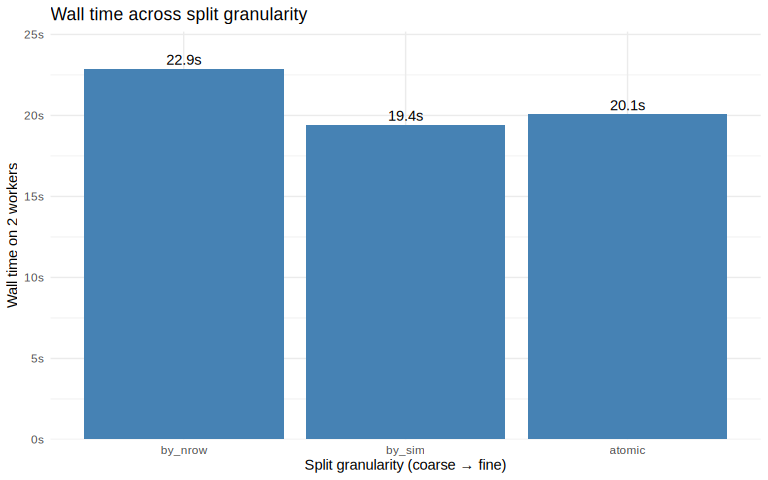
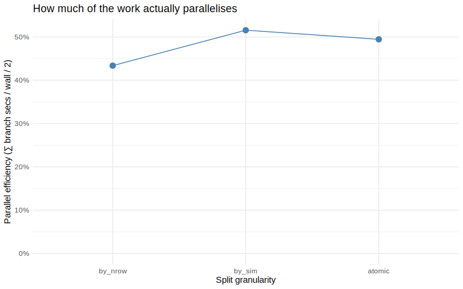
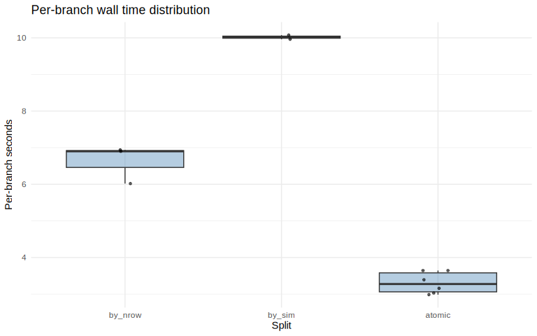

# Split granularity vs. wall time — `ssdsims` targets experiments

- [Configurations](#configurations)
- [Total wall time](#total-wall-time)
- [Parallel efficiency](#parallel-efficiency)
- [Per-branch time distribution](#per-branch-time-distribution)
- [Storage cost](#storage-cost)
- [Picking a split](#picking-a-split)
- [Reproducing this at scale](#reproducing-this-at-scale)

Each **atomic task** is one `fit_dists_seed()` call — one parquet file
per task containing the full HC sweep downstream of that fit. The
harness builds the same atomic grid for each split and lets the choice
of **split granularity** show up as a `dplyr::group_by()` over the
fit-grid columns. Dynamic branching (`iteration = "group"`) iterates
over groups, so each branch (= “job”) bundles one or more atomic tasks.

Compute target: **2 `crew_controller_local()` workers**.

## Configurations

| split   | split_axes | n_atomic_fits | n_branches | n_fits_per_branch |
|:--------|:-----------|--------------:|-----------:|------------------:|
| by_nrow | nrow       |             6 |          3 |                 2 |
| by_sim  | sim        |             6 |          2 |                 3 |
| atomic  | nrow+sim   |             6 |          6 |                 1 |

`n_atomic_fits` is identical across rows (the grid doesn’t change);
`n_branches` is the number of groups produced by the split, and
`n_fits_per_branch` shows how the work is packed.

## Total wall time

## Parallel efficiency

| split   | n_branches | branch_secs_total | wall_secs | parallel_eff |
|:--------|-----------:|------------------:|----------:|:-------------|
| by_nrow |          3 |              19.9 |      22.9 | 43%          |
| by_sim  |          2 |              20.0 |      19.4 | 52%          |
| atomic  |          6 |              19.9 |      20.1 | 49%          |

## Per-branch time distribution

| split   |   n | min_s | p50_s | mean_s | p90_s | max_s |
|:--------|----:|------:|------:|-------:|------:|------:|
| by_nrow |   3 |  6.02 |  6.90 |   6.62 |  6.93 |  6.94 |
| by_sim  |   2 |  9.96 | 10.02 |  10.02 | 10.06 | 10.07 |
| atomic  |   6 |  2.98 |  3.28 |   3.31 |  3.64 |  3.64 |

## Storage cost

| split   | n_branches | parquet_count | parquet_KB |
|:--------|-----------:|--------------:|-----------:|
| by_nrow |          3 |             6 |       18.7 |
| by_sim  |          2 |             6 |       18.7 |
| atomic  |          6 |             6 |       18.7 |

## Picking a split

The trade-off in one sentence: **enough branches to keep the workers
saturated, big enough work units that crew dispatch / parquet-write
overhead is amortised, small enough that interruption costs at most one
unit.**

Reading across the three splits:

- **`by_nrow`** bundles all sims of one nrow into one job. Few, fat
  branches; high parallel efficiency on workers ≤ n_branches, but
  scheduler can’t load-balance within an nrow.
- **`by_sim`** bundles one sim across all nrows. Different work profile
  per branch (one cheap small-nrow fit + one expensive large-nrow fit),
  still few branches.
- **`atomic`** runs each `(nrow, sim)` fit in its own branch. Maximum
  parallelism and finest interruption granularity at the cost of
  per-branch dispatch + parquet-write overhead paid `n` times.

The right split depends on the (fit cost vs. dispatch overhead) ratio on
your compute target. On HPC the overhead floor is much higher (≥ 5s
scheduler latency) so coarser splits win; on local crew the overhead is
small enough that atomic is often viable.

## Reproducing this at scale

The baseline grid is set up to finish in ~1 minute on 2 CPUs. To explore
the trade-off at production scale, bump knobs in `configs.R` — bigger
`nboot`, more `ci_method`s, more `nrow_levels`. Each knob roughly
multiplies branch count or per-branch cost in an obvious way; the
wall-time-vs-split shape stays the same, the constants get bigger.
